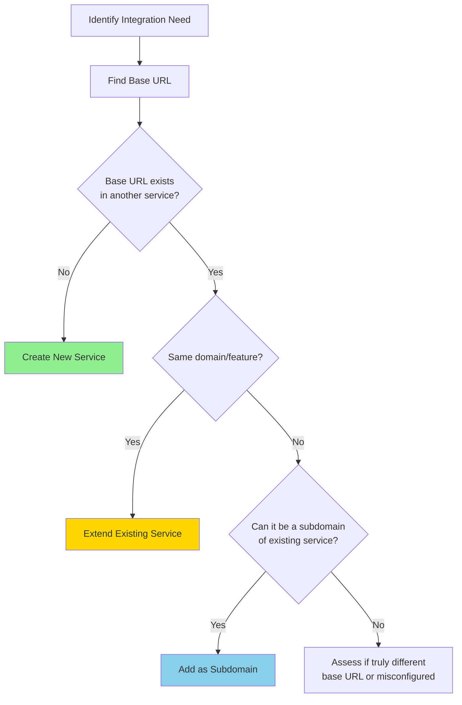
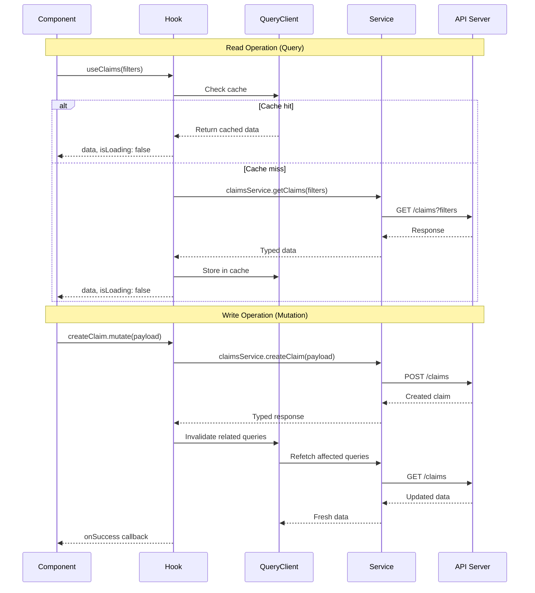

# Service Layer Architecture

> **Purpose:** Documentation of the colocated service layer architecture for admin-portal. This describes how API integrations are structured, organized, and maintained.

---

## Related Documentation

- [`SERVICE_IMPLEMENTATION_GUIDE.md`](file:///c:/Users/user/friendsuretech/projects/frontend-workspace/apps/admin-portal/docs/SERVICE_IMPLEMENTATION_GUIDE.md) - Step-by-step implementation guide
- [`SERVICE_REACTQUERY_PATTERNS.md`](file:///c:/Users/user/friendsuretech/projects/frontend-workspace/apps/admin-portal/docs/SERVICE_REACTQUERY_PATTERNS.md) - TanStack Query best practices

---

## Architecture Overview

This app uses a **colocated, service-first architecture** for all API integrations. Each service represents a distinct API domain and contains all related code in a single directory.

### Core Principles

1. **Colocation** - Everything for one domain lives together
2. **Service Boundaries** - One service per base URL/API domain
3. **Separation of Concerns** - Clear layers: API → Hooks → Components
4. **Type Safety** - Strongly typed TypeScript throughout
5. **Declarative Data Fetching** - TanStack Query for all data operations

---

## Directory Structure

```text
src/
├── lib/
│   ├── api-client/              # Shared HTTP client infrastructure
│   │   ├── client.ts            # Base axios instance
│   │   ├── config.ts            # API base URLs and configuration
│   │   ├── interceptors/        # Request/response interceptors
│   │   │   ├── auth.interceptor.ts
│   │   │   ├── error.interceptor.ts
│   │   │   └── logger.interceptor.ts
│   │   └── index.ts             # Public API
│   │
│   └── react-query/             # TanStack Query setup
│       ├── query-client.ts      # QueryClient configuration
│       ├── query-provider.tsx   # Provider component
│       └── devtools.tsx         # DevTools (dev only)
│
└── services/                    # Service layer (colocated by domain)
    ├── [service-name]/          # Example: claims, policies, users
    │   ├── api/                 # API layer
    │   │   ├── [service].endpoints.ts    # Endpoint constants
    │   │   ├── [service].types.ts        # TypeScript types/interfaces
    │   │   └── [service].service.ts      # API service functions
    │   │
    │   ├── hooks/               # React Query hooks
    │   │   ├── queries/         # Query hooks (GET operations)
    │   │   │   ├── use*.ts
    │   │   │   └── index.ts     # Barrel export
    │   │   │
    │   │   └── mutations/       # Mutation hooks (POST/PUT/DELETE)
    │   │       ├── use*.ts
    │   │       └── index.ts     # Barrel export
    │   │
    │   └── query-keys.ts        # Query key factory for cache management
    │
    └── ... (other services)
```

---

## Service Boundaries

### Definition

A **service** is defined by its **API base URL**, not by feature names or current folder structure.

### Rule: One Service Per Base URL

```typescript
// ✅ Correct: One service for one base URL
const POLICY_BASE_URL = process.env.NEXT_PUBLIC_POLICY_API;
// Service: 'policies'

// ❌ Incorrect: Multiple services for same base URL
// Don't create:
// - services/policy-claims/
// - services/policy-analytics/
// They should be ONE service: services/policies/
```

### Service Discovery Process



### Examples

**Example 1: Single service with multiple features**

```typescript
// Base URL: https://api.insurance.com/policies
// Service name: policies

// Endpoints:
// - /policies                    → policy list
// - /policies/{id}               → policy detail
// - /policies/{id}/claims        → policy claims
// - /policies/{id}/analytics     → policy analytics

// All belong to ONE service: services/policies/
```

**Example 2: Multiple services with different base URLs**

```typescript
// Service 1: claims
// Base URL: https://api.insurance.com/claims

// Service 2: users
// Base URL: https://api.insurance.com/users

// Service 3: payments
// Base URL: https://payments.stripe.com/v1
```

---

## Architecture Layers

### Layer 1: Shared Infrastructure (`lib/`)

**Purpose:** Provide shared utilities for all services

#### API Client (`lib/api-client/`)

Creates configured axios instances with interceptors:

```typescript
// lib/api-client/client.ts
export function createApiClient(config: AxiosRequestConfig) {
  const client = axios.create({
    ...defaultConfig,
    ...config,
  });

  // Apply interceptors
  client.interceptors.request.use(authInterceptor);
  client.interceptors.response.use(successHandler, errorHandler);

  return client;
}
```

#### React Query Setup (`lib/react-query/`)

Configures TanStack Query client:

```typescript
// lib/react-query/query-client.ts
export const queryClient = new QueryClient({
  defaultOptions: {
    queries: {
      staleTime: 1000 * 60 * 5, // 5 minutes
      cacheTime: 1000 * 60 * 30, // 30 minutes
      retry: 1,
      refetchOnWindowFocus: false,
    },
  },
});
```

---

### Layer 2: API Layer (`services/[service]/api/`)

**Purpose:** Encapsulate all HTTP communication for a service domain

#### Endpoints (`*.endpoints.ts`)

Define URL constants:

```typescript
export const CLAIMS_ENDPOINTS = {
  list: '/v1/claims',
  detail: (id: string) => `/v1/claims/${id}`,
  create: '/v1/claims',
  updateStatus: (id: string) => `/v1/claims/${id}/status`,
} as const;
```

#### Types (`*.types.ts`)

Define TypeScript interfaces:

```typescript
export interface Claim {
  id: string;
  status: ClaimStatus;
  amount: number;
}

export interface ClaimFilters {
  status?: ClaimStatus;
  dateFrom?: string;
}
```

#### Service Functions (`*.service.ts`)

Implement typed API calls:

```typescript
import { createApiClient, API_BASE_URLS } from '@/lib/api-client';

const claimsApi = createApiClient({ baseURL: API_BASE_URLS.claims });

export const claimsService = {
  getClaims: async (filters: ClaimFilters) => {
    const response = await claimsApi.get<Claim[]>(CLAIMS_ENDPOINTS.list, {
      params: filters,
    });
    return response.data;
  },
};
```

---

### Layer 3: Query Keys (`query-keys.ts`)

**Purpose:** Centralized cache key management with hierarchical structure

```typescript
export const claimKeys = {
  all: ['claims'] as const,
  lists: () => [...claimKeys.all, 'list'] as const,
  list: (filters: ClaimFilters) => [...claimKeys.lists(), filters] as const,
  details: () => [...claimKeys.all, 'detail'] as const,
  detail: (id: string) => [...claimKeys.details(), id] as const,
};
```

**Benefits:**

- Precise cache invalidation
- Consistent key structure
- Type-safe keys
- Easy to maintain

---

### Layer 4: Hooks Layer (`services/[service]/hooks/`)

**Purpose:** Provide React hooks for components to consume data

#### Query Hooks (`hooks/queries/`)

For **read operations** (GET):

```typescript
export function useClaims(
  filters: ClaimFilters,
  options?: Omit<UseQueryOptions<ClaimsResult, Error>, 'queryKey' | 'queryFn'>,
) {
  return useQuery({
    queryKey: claimKeys.list(filters),
    queryFn: () => claimsService.getClaims(filters),
    ...options,
  });
}
```

#### Mutation Hooks (`hooks/mutations/`)

For **write operations** (POST/PUT/DELETE):

```typescript
export function useCreateClaim(
  options?: UseMutationOptions<ClaimResult, Error, CreateClaimRequest>,
) {
  const queryClient = useQueryClient();

  return useMutation({
    mutationFn: claimsService.createClaim,
    ...options,
    onSuccess: (data, variables, context) => {
      queryClient.invalidateQueries({ queryKey: claimKeys.lists() });
      options?.onSuccess?.(data, variables, context);
    },
  });
}
```

---

### Layer 5: Components (Consumers)

**Purpose:** UI components consume service hooks

```typescript
import { useCreateClaim } from '@/services/claims/hooks/mutations';
import { useClaims } from '@/services/claims/hooks/queries';

export function ClaimsPage() {
  const { data, isLoading } = useClaims({ status: 'pending' });
  const createClaim = useCreateClaim();

  // Render UI
}
```

---

## Data Flow



---

## Why Colocated Architecture?

### Benefits

- ✅ **Colocated by domain** - All related code in one place
- ✅ **Automatic caching and refetching** - TanStack Query handles data lifecycle
- ✅ **Declarative data fetching** - Hooks abstract complexity
- ✅ **Clear service boundaries** - One service per base URL
- ✅ **Type-safe throughout** - Full TypeScript support
- ✅ **Easy to scale** - Add services without touching existing code
- ✅ **Better code splitting** - Natural bundle boundaries
- ✅ **Easier testing** - Isolated service logic

---

## Architectural Decisions (ADRs)

### ADR-001: Service Boundaries Defined by Base URL

**Decision:** One service per distinct API base URL

**Rationale:**

- Base URLs represent infrastructure boundaries
- Aligns with backend service architecture
- Prevents artificial fragmentation
- Simplifies API client configuration

**Consequences:**

- Services may contain multiple related features
- Need clear subdomain organization within services
- Easier to manage API credentials and configuration

---

### ADR-002: Colocated Architecture

**Decision:** Group all service-related code in one directory

**Rationale:**

- Improves code discoverability
- Reduces cognitive load (everything in one place)
- Enables better code splitting
- Aligns with modern React patterns

**Consequences:**

- Requires discipline to maintain structure
- New developers need clear documentation
- Initial setup requires more planning

---

### ADR-003: TanStack Query for All Data Fetching

**Decision:** Use TanStack Query hooks exclusively for data operations

**Rationale:**

- Automatic caching and background refetching
- Request deduplication
- Built-in optimistic updates
- DevTools for debugging
- Industry standard

**Consequences:**

- Learning curve for developers unfamiliar with React Query
- Requires QueryClient configuration
- Slightly more boilerplate for simple requests

---

### ADR-004: Hook Signature Standardization

**Decision:** All hooks accept optional `options` parameter

**Rationale:**

- Flexibility for consumers to override defaults
- Enables custom caching strategies per use case
- Consistent API across all hooks

**Consequences:**

- More verbose hook signatures
- Requires careful type definitions
- Must remember to call `options?.onSuccess` in mutations

---

## Anti-Patterns

### ❌ Multiple services for same base URL

```typescript
// Wrong
src / services / policy -
  claims / // Uses POLICY_API
    src /
    services /
    policy -
  reports / // Uses POLICY_API <- Same base URL!
    // Correct
    src /
    services /
    policies /
    api /
    policies.endpoints.ts; // Contains both claims and reports endpoints
```

---

### ❌ Direct API calls in components

```typescript
// Wrong
function ClaimsList() {
  const [claims, setClaims] = useState([]);

  useEffect(() => {
    fetch('/api/claims')
      .then((res) => res.json())
      .then(setClaims);
  }, []);
}

// Correct
function ClaimsList() {
  const { data: claims } = useClaims();
}
```

---

### ❌ Bypassing service layer

```typescript
// Wrong
// Correct
import { useClaimById } from '@/services/claims/hooks/queries';

import axios from 'axios';

function ClaimDetail({ id }) {
  const [claim, setClaim] = useState();

  useEffect(() => {
    axios.get(`/api/claims/${id}`).then((res) => setClaim(res.data));
  }, [id]);
}

function ClaimDetail({ id }) {
  const { data: claim } = useClaimById(id);
}
```

---

### ❌ Shared types/constants outside service

```typescript
// Wrong
src / types / claim.types.ts; // Shared types NOT in service
src / constants / api.ts; // API constants outside service

// Correct
src / services / claims / api / claims.types.ts; // Types with service
src / services / claims / api / claims.endpoints.ts; // Constants with service
```

---

## Comparison Table

| Aspect              | Old (Legacy)                         | New (Colocated)              |
| ------------------- | ------------------------------------ | ---------------------------- |
| **Organization**    | By layer (services/, types/, hooks/) | By domain (services/claims/) |
| **Data Fetching**   | Manual fetch + useState + useEffect  | TanStack Query hooks         |
| **Caching**         | None or manual                       | Automatic                    |
| **Type Safety**     | Partial                              | Full                         |
| **Discoverability** | Difficult (scattered files)          | Easy (colocated)             |
| **Scaling**         | Hard (shared files get large)        | Easy (isolated domains)      |
| **Code Splitting**  | Difficult                            | Natural                      |
| **Testing**         | Complex (many dependencies)          | Isolated (per service)       |

---

## Best Practices

### 1. Service Naming

- Use **domain names**, not feature names
- Use **plural forms** (e.g., `claims`, not `claim`)
- Keep names **short** and **descriptive**

```
✅ claims, policies, users, payments
❌ claimManagement, policyService, userAuth
```

---

### 2. File Naming

- Use **service name prefix** for all files
- Keep **consistent patterns** across services

```
claims.endpoints.ts
claims.types.ts
claims.service.ts
```

---

### 3. API Client Usage

- Create **one client instance per service**
- Bind to correct **base URL**
- Reuse **shared interceptors**

```typescript
const claimsApi = createApiClient({ baseURL: API_BASE_URLS.claims });
```

---

### 4. Query Key Design

- Use **hierarchical structure**
- Enable **precise invalidation**
- Keep keys **serializable**

```typescript
claimKeys.all; // Invalidates everything
claimKeys.lists(); // Invalidates all lists
claimKeys.list(filters); // Invalidates specific filtered list
claimKeys.detail(id); // Invalidates specific detail
```

---

### 5. Cache Invalidation

- Invalidate **broader keys** for safety
- Be **specific** when possible
- Think about **related queries**

```typescript
// After creating a claim
queryClient.invalidateQueries({ queryKey: claimKeys.lists() }); // All lists

// After updating a claim
queryClient.invalidateQueries({ queryKey: claimKeys.detail(id) }); // Specific detail
queryClient.invalidateQueries({ queryKey: claimKeys.lists() }); // All lists (might appear in lists)
```
