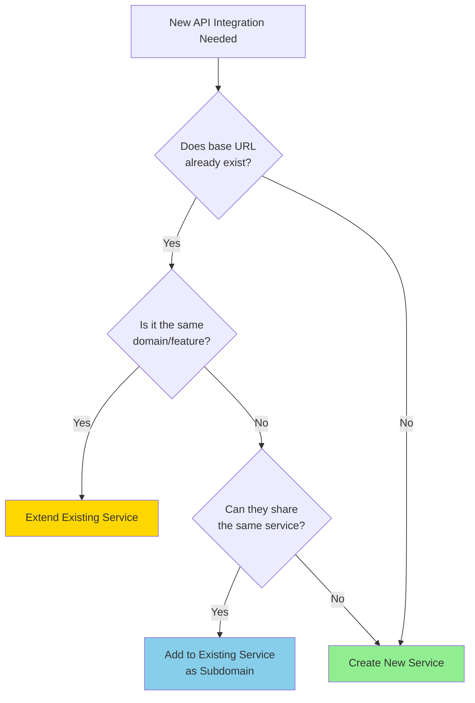

# Service Implementation Guide

> **Purpose:** Comprehensive guide for implementing new API service integrations in the admin-portal using the colocated service architecture with TanStack Query.

---

## Related Documentation

- [`SERVICE_ARCHITECTURE.md`](file:///c:/Users/user/friendsuretech/projects/frontend-workspace/apps/admin-portal/docs/SERVICE_ARCHITECTURE.md) - Service layer architecture overview
- [`SERVICE_REACTQUERY_PATTERNS.md`](file:///c:/Users/user/friendsuretech/projects/frontend-workspace/apps/admin-portal/docs/SERVICE_REACTQUERY_PATTERNS.md) - TanStack Query patterns and best practices

---

## When to Create a New Service

Use this decision tree to determine if you need a new service:



### Key Principles

**One Service = One Base URL**

- If multiple features share the same base URL, they belong to **one service**
- Organize endpoints within the service by subdomain/feature
- Example: `/api/claims`, `/api/claims/analytics` → **one** `claims` service

**When to Extend vs Create:**

- **Extend:** Same base URL, related domain → Add endpoints to existing service
- **Create:** Different base URL OR completely unrelated domain → New service folder

---

## Implementation Checklist

### 1. Map the Service Boundary

> [!IMPORTANT]
> Service boundaries are defined by **base URL**, not by feature names or current folder structure.

**Steps:**

- [ ] Identify the API base URL (environment variable or fixed URL)
- [ ] Check if base URL already exists in another service
- [ ] Decide on service name (use domain name, not feature name)
- [ ] Document base URL mapping

**Example:**

```typescript
// ✅ Good: One service per base URL
const POLICY_BASE_URL = process.env.NEXT_PUBLIC_POLICY_API;
// Service name: 'policies'

// ❌ Bad: Multiple services for same base URL
// Don't create separate 'policy-claims' and 'policy-analytics' services
// if they share the same base URL
```

---

### 2. Create Service Directory Structure

Create the following structure under `src/services/<service-name>/`:

```
src/services/<service-name>/
├── api/
│   ├── <service>.endpoints.ts   # API endpoint constants
│   ├── <service>.types.ts       # TypeScript interfaces/types
│   └── <service>.service.ts     # API service functions
├── hooks/
│   ├── queries/
│   │   ├── use*.ts              # Individual query hooks
│   │   └── index.ts             # Query hook barrel export
│   ├── mutations/
│   │   ├── use*.ts              # Individual mutation hooks
│   │   └── index.ts             # Mutation hook barrel export
└── query-keys.ts                # TanStack Query key factory
```

**Command:**

```bash
# Create service structure
mkdir -p src/services/<service-name>/api
mkdir -p src/services/<service-name>/hooks/queries
mkdir -p src/services/<service-name>/hooks/mutations
```

---

### 3. Implement API Layer

#### 3.1 Define Endpoints (`*.endpoints.ts`)

Define all API endpoints as **typed constants**:

```typescript
// src/services/claims/api/claims.endpoints.ts
export const CLAIMS_ENDPOINTS = {
  // List endpoints
  list: '/v1/claims',
  search: '/v1/claims/search',

  // Detail endpoints
  detail: (id: string) => `/v1/claims/${id}`,
  history: (id: string) => `/v1/claims/${id}/history`,

  // Mutation endpoints
  create: '/v1/claims',
  updateStatus: (id: string) => `/v1/claims/${id}/status`,
  delete: (id: string) => `/v1/claims/${id}`,
} as const;
```

> [!TIP]
> Use **factory functions** for dynamic endpoints (e.g., `detail: (id) => \`/claims/\${id}\``).

---

#### 3.2 Define Types (`*.types.ts`)

Define all TypeScript interfaces and types:

```typescript
// src/services/claims/api/claims.types.ts

// DTOs (Data Transfer Objects)
export interface Claim {
  id: string;
  policyId: string;
  status: ClaimStatus;
  amount: number;
  submittedAt: string;
  approvedAt?: string;
}

export type ClaimStatus = 'pending' | 'approved' | 'rejected' | 'processing';

// Request/Response types
export interface ClaimFilters {
  status?: ClaimStatus;
  policyId?: string;
  dateFrom?: string;
  dateTo?: string;
}

export interface CreateClaimRequest {
  policyId: string;
  amount: number;
  description: string;
  documents: string[];
}

export interface UpdateClaimStatusRequest {
  status: ClaimStatus;
  notes?: string;
}

// API Response wrappers
export interface ClaimsListResponse {
  data: Claim[];
  total: number;
  page: number;
  pageSize: number;
}
```

> [!TIP]
> **Naming conventions:**
>
> - Entities: `Claim`, `Policy`
> - Requests: `CreateClaimRequest`, `UpdateClaimStatusRequest`
> - Responses: `ClaimsListResponse`, `ClaimDetailResponse`
> - Filters/Params: `ClaimFilters`, `ClaimSearchParams`

---

#### 3.3 Implement Service Functions (`*.service.ts`)

Create typed API functions using the shared API client:

```typescript
// src/services/claims/api/claims.service.ts
import { createApiClient, API_BASE_URLS } from '@/lib/api-client';

import { CLAIMS_ENDPOINTS } from './claims.endpoints';
import type {
  Claim,
  ClaimFilters,
  ClaimsListResponse,
  CreateClaimRequest,
  UpdateClaimStatusRequest,
} from './claims.types';

// Create service-specific API client
const claimsApi = createApiClient({
  baseURL: API_BASE_URLS.claims,
});

export const claimsService = {
  // GET operations
  getClaims: async (filters: ClaimFilters = {}) => {
    const response = await claimsApi.get<ClaimsListResponse>(CLAIMS_ENDPOINTS.list, {
      params: filters,
    });
    return response.data;
  },

  getClaimById: async (id: string) => {
    const response = await claimsApi.get<Claim>(CLAIMS_ENDPOINTS.detail(id));
    return response.data;
  },

  // POST operations
  createClaim: async (data: CreateClaimRequest) => {
    const response = await claimsApi.post<Claim>(CLAIMS_ENDPOINTS.create, data);
    return response.data;
  },

  // PUT/PATCH operations
  updateClaimStatus: async (id: string, data: UpdateClaimStatusRequest) => {
    const response = await claimsApi.patch<Claim>(CLAIMS_ENDPOINTS.updateStatus(id), data);
    return response.data;
  },

  // DELETE operations
  deleteClaim: async (id: string) => {
    await claimsApi.delete(CLAIMS_ENDPOINTS.delete(id));
  },
};
```

---

### 4. Implement Query Keys

Create a **hierarchical query key factory** for cache management:

```typescript
// src/services/claims/query-keys.ts
import type { ClaimFilters } from './api/claims.types';

export const claimKeys = {
  // Base key
  all: ['claims'] as const,

  // List keys
  lists: () => [...claimKeys.all, 'list'] as const,
  list: (filters: ClaimFilters = {}) => [...claimKeys.lists(), filters] as const,

  // Detail keys
  details: () => [...claimKeys.all, 'detail'] as const,
  detail: (id: string) => [...claimKeys.details(), id] as const,

  // Specialized keys
  history: (id: string) => [...claimKeys.detail(id), 'history'] as const,
  analytics: (filters: ClaimFilters = {}) => [...claimKeys.all, 'analytics', filters] as const,
};
```

> [!IMPORTANT]
> **Query key hierarchy enables precise cache invalidation:**
>
> - `claimKeys.all` → Invalidates ALL claim-related queries
> - `claimKeys.lists()` → Invalidates ALL list queries
> - `claimKeys.list(filters)` → Invalidates specific filtered list

---

### 5. Implement Hooks

#### 5.1 Query Hooks (GET operations)

Create hooks in `hooks/queries/`:

```typescript
// src/services/claims/hooks/queries/useClaims.ts
import { useQuery, type UseQueryOptions } from '@tanstack/react-query';

import { claimsService } from '../../api/claims.service';
import type { ClaimFilters, ClaimsListResponse } from '../../api/claims.types';
import { claimKeys } from '../../query-keys';

type ClaimsQueryResult = Awaited<ReturnType<typeof claimsService.getClaims>>;

export function useClaims(
  filters: ClaimFilters = {},
  options?: Omit<UseQueryOptions<ClaimsQueryResult, Error>, 'queryKey' | 'queryFn'>,
) {
  return useQuery({
    queryKey: claimKeys.list(filters),
    queryFn: () => claimsService.getClaims(filters),
    ...options,
  });
}
```

```typescript
// src/services/claims/hooks/queries/useClaimById.ts
import { useQuery, type UseQueryOptions } from '@tanstack/react-query';

import { claimsService } from '../../api/claims.service';
import type { Claim } from '../../api/claims.types';
import { claimKeys } from '../../query-keys';

type ClaimQueryResult = Awaited<ReturnType<typeof claimsService.getClaimById>>;

export function useClaimById(
  id: string,
  options?: Omit<UseQueryOptions<ClaimQueryResult, Error>, 'queryKey' | 'queryFn'>,
) {
  return useQuery({
    queryKey: claimKeys.detail(id),
    queryFn: () => claimsService.getClaimById(id),
    enabled: !!id, // Don't fetch if no ID
    ...options,
  });
}
```

**Export barrel file:**

```typescript
// src/services/claims/hooks/queries/index.ts
export { useClaims } from './useClaims';
export { useClaimById } from './useClaimById';
```

---

#### 5.2 Mutation Hooks (POST/PUT/DELETE operations)

Create hooks in `hooks/mutations/`:

```typescript
// src/services/claims/hooks/mutations/useCreateClaim.ts
import { useMutation, useQueryClient, type UseMutationOptions } from '@tanstack/react-query';

import { claimsService } from '../../api/claims.service';
import type { Claim, CreateClaimRequest } from '../../api/claims.types';
import { claimKeys } from '../../query-keys';

type CreateClaimResult = Awaited<ReturnType<typeof claimsService.createClaim>>;

export function useCreateClaim(
  options?: UseMutationOptions<CreateClaimResult, Error, CreateClaimRequest>,
) {
  const queryClient = useQueryClient();

  return useMutation({
    mutationFn: claimsService.createClaim,
    ...options,
    onSuccess: (data, variables, context) => {
      // Invalidate all list queries
      queryClient.invalidateQueries({ queryKey: claimKeys.lists() });

      // Call consumer's onSuccess if provided
      options?.onSuccess?.(data, variables, context);
    },
  });
}
```

```typescript
// src/services/claims/hooks/mutations/useUpdateClaimStatus.ts
import { useMutation, useQueryClient, type UseMutationOptions } from '@tanstack/react-query';

import { claimsService } from '../../api/claims.service';
import type { Claim, UpdateClaimStatusRequest } from '../../api/claims.types';
import { claimKeys } from '../../query-keys';

type UpdateStatusResult = Awaited<ReturnType<typeof claimsService.updateClaimStatus>>;
type UpdateStatusVariables = { id: string; data: UpdateClaimStatusRequest };

export function useUpdateClaimStatus(
  options?: UseMutationOptions<UpdateStatusResult, Error, UpdateStatusVariables>,
) {
  const queryClient = useQueryClient();

  return useMutation({
    mutationFn: ({ id, data }) => claimsService.updateClaimStatus(id, data),
    ...options,
    onSuccess: (data, variables, context) => {
      // Invalidate specific claim detail
      queryClient.invalidateQueries({ queryKey: claimKeys.detail(variables.id) });
      // Invalidate all lists (status might filter lists)
      queryClient.invalidateQueries({ queryKey: claimKeys.lists() });

      // Call consumer's onSuccess if provided
      options?.onSuccess?.(data, variables, context);
    },
  });
}
```

**Export barrel file:**

```typescript
// src/services/claims/hooks/mutations/index.ts
export { useCreateClaim } from './useCreateClaim';
export { useUpdateClaimStatus } from './useUpdateClaimStatus';
export { useDeleteClaim } from './useDeleteClaim';
```

---

### 6. Consume in UI Components

Import and use service hooks in components:

```typescript
// src/app/claims/page.tsx
import { useClaims } from '@/services/claims/hooks/queries';
import { useCreateClaim } from '@/services/claims/hooks/mutations';

export default function ClaimsPage() {
  // Query hook for data fetching
  const { data, isLoading, error } = useClaims({ status: 'pending' });

  // Mutation hook for creating claims
  const createClaim = useCreateClaim({
    onSuccess: () => {
      toast.success('Claim created successfully');
    },
  });

  const handleSubmit = (formData: CreateClaimRequest) => {
    createClaim.mutate(formData);
  };

  if (isLoading) return <div>Loading...</div>;
  if (error) return <div>Error: {error.message}</div>;

  return (
    <div>
      <h1>Claims ({data?.total})</h1>
      {/* Render claims */}
    </div>
  );
}
```

> [!IMPORTANT]
> **Component Best Practices:**
>
> - ✅ Import hooks from `@/services/<service>/hooks/{queries,mutations}`
> - ✅ Use hook's built-in loading/error states
> - ✅ Pass custom options to hooks when needed
> - ❌ Don't use raw `useQuery`/`useMutation` in components
> - ❌ Don't import service functions directly in components
> - ❌ Don't make `fetch`/`axios` calls in components

---

### 7. Verification

Run all verification checks:

```bash
# Type check
pnpm --filter admin-portal exec tsc --noEmit

# Build
pnpm --filter admin-portal run build

# Lint
pnpm --filter admin-portal run lint

# Tests (if available)
pnpm --filter admin-portal run test
```

**Manual verification checklist:**

- [ ] Service structure created correctly
- [ ] All endpoints defined with correct types
- [ ] Service functions return correct types
- [ ] Query keys follow hierarchical pattern
- [ ] Query hooks accept optional `options` parameter
- [ ] Mutation hooks invalidate correct cache keys
- [ ] Mutation hooks call `options?.onSuccess` if provided
- [ ] Barrel exports created for hooks
- [ ] Components use hooks correctly
- [ ] No TypeScript errors
- [ ] App builds successfully
- [ ] Features work as expected

---

## Troubleshooting

### Issue: TypeScript errors on hook signatures

**Cause:** Incorrect `options` parameter type

**Solution:**

```typescript
// ❌ Wrong
options?: UseQueryOptions<Data, Error>

// ✅ Correct - Omit queryKey and queryFn
options?: Omit<UseQueryOptions<Data, Error>, 'queryKey' | 'queryFn'>
```

---

### Issue: Cache not invalidating after mutation

**Cause:** Query keys don't match

**Solution:**

```typescript
// Use the SAME key factory in both query and mutation
// Query
queryKey: claimKeys.list(filters);

// Mutation invalidation
queryClient.invalidateQueries({ queryKey: claimKeys.lists() });
```

---

### Issue: `options?.onSuccess` not called

**Cause:** Forgot to call consumer's `onSuccess`

**Solution:**

```typescript
// ✅ Always call options?.onSuccess inside your onSuccess
onSuccess: (data, variables, context) => {
  queryClient.invalidateQueries({ queryKey: claimKeys.lists() });
  options?.onSuccess?.(data, variables, context); // Don't forget this!
};
```

---

### Issue: Base URL undefined

**Cause:** Environment variable not set

**Solution:**

```bash
# Check .env file
NEXT_PUBLIC_CLAIMS_API=https://api.example.com/claims

# Or update API_BASE_URLS in lib/api-client/config.ts
export const API_BASE_URLS = {
  claims: process.env.NEXT_PUBLIC_CLAIMS_API || 'http://localhost:3001',
};
```

---

## Anti-Patterns to Avoid

### ❌ Don't: Create multiple services for same base URL

```typescript
// ❌ Wrong
src / services / policy -
  claims / src / services / policy -
  analytics /
    // Both use same base URL: POLICY_API

    // ✅ Correct
    src /
    services /
    policies /
    api /
    policies.endpoints.ts; // Has both claims and analytics endpoints
```

---

### ❌ Don't: Use raw fetch/axios in components

```typescript
// ❌ Wrong
const fetchClaims = async () => {
  const res = await fetch('/api/claims');
  const data = await res.json();
  setClaims(data);
};

// ✅ Correct
const { data: claims } = useClaims();
```

---

### ❌ Don't: Create hooks without options parameter

```typescript
// ❌ Wrong - No options parameter
export function useClaims(filters: ClaimFilters) {
  return useQuery({
    queryKey: claimKeys.list(filters),
    queryFn: () => claimsService.getClaims(filters),
  });
}

// ✅ Correct - Accept options
export function useClaims(
  filters: ClaimFilters,
  options?: Omit<UseQueryOptions<...>, 'queryKey' | 'queryFn'>
) {
  return useQuery({
    queryKey: claimKeys.list(filters),
    queryFn: () => claimsService.getClaims(filters),
    ...options, // Spread options
  });
}
```

---

## Quick Reference

### Service checklist

```
src/services/<service>/
├── api/
│   ├── *.endpoints.ts ✅
│   ├── *.types.ts ✅
│   └── *.service.ts ✅
├── hooks/
│   ├── queries/
│   │   ├── use*.ts ✅
│   │   └── index.ts ✅
│   └── mutations/
│       ├── use*.ts ✅
│       └── index.ts ✅
└── query-keys.ts ✅
```

### Hook signature templates

```typescript
// Query hook
export function useResource(
  params: Params,
  options?: Omit<UseQueryOptions<Result, Error>, 'queryKey' | 'queryFn'>,
) {
  return useQuery({ queryKey, queryFn, ...options });
}

// Mutation hook
export function useCreateResource(options?: UseMutationOptions<Result, Error, Variables>) {
  return useMutation({
    mutationFn,
    ...options,
    onSuccess: (data, variables, context) => {
      invalidateQueries();
      options?.onSuccess?.(data, variables, context);
    },
  });
}
```
