# Legacy Update Integration Guide (Component Migration)

> **Purpose:** Quick reference for integrating legacy repo updates with the component migration workflow. Use this when a legacy update arrives during an active migration batch.

---

## Related Documents

- `legacy-update-routines.md` — Full routine details
- `legacy-update-batch-prompts.md` — Copy-paste AI prompts (standalone reference)
- `migration-batch-prompts.md` — **Preferred:** AI-native L1–L6 prompts integrated into master execution file
- `00-overview.md` — Branch model & integrate/\* contract
- `01-app-audit.md` — Component classification reference
- `05-app-migration.md` — Batch execution guide
- [`06-component-standards.md` §6 Shared-vs-Local Boundary](./06-component-standards.md#6-shared-vs-local-boundary-framework) — Full shared-vs-local boundary rules
- `apps/<APP_NAME>/docs/migration/verification-gate.md` — App-specific verification commands

---

## When to Run Legacy Updates

Legacy updates can arrive at **any batch**. Risk and workflow vary by current position:

| Current Batch Position                            | Risk Level  | Workflow                                                                                                                                       |
| ------------------------------------------------- | ----------- | ---------------------------------------------------------------------------------------------------------------------------------------------- |
| **Batch 0** done, **Batch 0.5 not yet started**   | ✅ Low      | Direct integration — dep upgrade not yet in progress                                                                                           |
| **Batch 0.5** (dep upgrade in progress)           | ⚠️ Medium   | Pause dep upgrade → integrate legacy → re-confirm platform versions still correct, then resume Batch 0.5 from the next step                    |
| **Batch 1.5** (SoC split in progress)             | ⚠️ Medium   | Finish current component split commit first → integrate legacy → re-run SoC evaluation on any new KEEP_APP_LOCAL components → resume Batch 1.5 |
| **Batch 1** (import swaps in progress)            | ⚠️ Medium   | Pause → Update → Re-verify that import swaps still resolve                                                                                     |
| **Batch 2** (adapter wrappers in progress)        | ⚠️ Medium   | Pause → Update → Check adapters still bridge correctly                                                                                         |
| **Batch 3** (packages/ui extensions in progress)  | ⚠️ Medium   | Pause → Update → Check legacy didn't add overlapping component                                                                                 |
| **Batch 4** (new component builds in progress)    | ⚠️ Medium   | Pause → Update → Check legacy didn't add same component                                                                                        |
| **Batch 5** (stabilization complete)              | 🔴 High     | Must use incremental intake for any new legacy components                                                                                      |
| **Batch 6** (cleanup done — local copies deleted) | 🔴 Critical | Incremental intake mandatory — cannot re-add deleted locals                                                                                    |

---

## Pause / Resume Workflow

### Before Running a Legacy Update

> [!IMPORTANT]
> **Cross-Track State Check (if running parallel migrations):** Before starting, record the current state of BOTH tracks:
> - **Component migration:** Current batch and last completed component (e.g., "Batch 4 — paused after ClaimsTable SoC")
> - **Service migration:** Current phase and batch (e.g., "Phase 4B / Batch 5 — all claims hooks done" or "N/A")
> This snapshot is required to correctly restore both tracks after the legacy update and enables cross-track impact review.

If currently at an active batch step:

1. **Complete the current component** being migrated (don't stop mid-migration)
2. **Document pause point** in `migration-plan.md`:

   ```markdown
   ## Pause Record

   - Batch: <e.g., Batch 4>
   - Component in progress: <ComponentName> — <last completed step>
   - Status: ⏸️ Paused for legacy update
   - Timestamp: <YYYY-MM-DD HH:MM>
   ```

3. **Commit and push current work:**

   ```bash
   git add .
   git commit -m "chore: pause Batch 4 migration for legacy update"
   git push origin migrate-app/<APP_NAME>
   ```

4. **Immediately after merge, run Merge Health Check (MHC):**

   ```text
Use the exact app typecheck and build commands defined in `verification-gate.md` §1 and §3.
```

   - If MHC fails: stop, fix narrowly (conflicted files only), re-run MHC before proceeding to Batch 2 or Batch 3
   - If MHC passes: proceed with Batch 2/3

5. **Proceed** with legacy update Batch 1

### After Legacy Update Verification

Once Batch 6 (verification) passes:

1. **Update `migration-plan.md`:**

   ```markdown
   ## Pause Record

   - Batch: <e.g., Batch 4>
   - Component in progress: <ComponentName>
   - Status: ▶️ Resumed after legacy update
   - Legacy update integrated: <timestamp>
   - Affected components: <list or "none">
   - New packages/ui intake items: <list or "none">
   ```

2. **Review impact on current work:**
   - Did legacy modify any component currently being migrated? → Review diff carefully before resuming
   - Did legacy add a component that overlaps with a packages/ui build in progress on `feat/ui`? → Coordinate with packages/ui work
   - Did any config change break current component builds? → Fix before resuming batch

3. **Cross-Track Impact Review (if service migration is active):**

   > [!IMPORTANT]
   > Before resuming component migration, check whether the legacy update also affects the service migration track:
   - Did this update add new endpoints to a service currently being hooked by the service migration batch? → Alert the service migration agent to include those new endpoints before hooks are finalized
   - Did this update introduce new TypeScript types that change the contract with the already-refactored service layer? → Verify API client types are still aligned
   - Did this update touch infrastructure files (API client, query setup) that service migration depends on? → Coordinate with the service migration track before resuming either track
   - Document impact (or `cross-track impact: none`) in `legacy-updates/legacy-update-YYYYMMDD-HHMMSS.md`

4. **Resume batch** from the documented component step

---

## Decision Tree: What to Do with New Legacy Components

After Batch 3 identifies new component files from the legacy update:

```mermaid
flowchart TD
    A[New component file from legacy] --> B{Is it in _audit-report.md?}
    B -->|Yes, with classification| C{Classification?}
    B -->|No / Unknown| D[Classify now using 06-component-standards.md]
    D --> C
    C -->|KEEP_APP_LOCAL| SOC{Universal SoC Evaluation<br/>per §6.2 — Is monolith?}
    SOC -->|HIGH or MEDIUM SoC potential| MAF[Classification = MIGRATE_AFTER_SPLIT<br/>Add to Batch 1.5 queue<br/>Record SoC fields in _audit-report.md]
    SOC -->|LOW or NONE| E[Accept theirs OK<br/>Add to _audit-report.md with SoC fields<br/>batch = N/A]
    C -->|ADOPT_NOW| F[Check if @repo/ui already has it<br/>If yes → immediate Batch 1 swap<br/>If no → re-classify]
    C -->|EXTEND_EXISTING| G[Add to _output/_spec-input.md<br/>Queue for packages/ui Batch 3<br/>Keep legacy local file until Batch 3 ships]
    C -->|NEW_SHARED_COMPONENT| H[Add to _output/_spec-input.md + _component-backlog.csv<br/>Queue for packages/ui Batch 4<br/>Keep legacy local file until Batch 4 ships]
```



### Quick Classification Shortcut

> **Full rules:** See [`06-component-standards.md` §6 Shared-vs-Local Boundary](./06-component-standards.md#6-shared-vs-local-boundary-framework) for the complete decision tree.

| Component type                                         | Class                            | Action                     |
| ------------------------------------------------------ | -------------------------------- | -------------------------- |
| Domain form (API calls, business logic)                | `KEEP_APP_LOCAL`                 | Keep as-is + **SoC check** |
| Table column config                                    | `KEEP_APP_LOCAL`                 | Keep as-is + **SoC check** |
| Page-level layout                                      | `KEEP_APP_LOCAL`                 | Keep as-is + **SoC check** |
| Generic UI primitive (Button, Input variant)           | `EXTEND_EXISTING` or `ADOPT_NOW` | packages/ui intake         |
| Generic composite (new DataTable pattern, new Dialog)  | `NEW_SHARED_COMPONENT`           | packages/ui Batch 4 intake |
| Generic display-only (EmptyState, StatusBadge variant) | `NEW_SHARED_COMPONENT`           | packages/ui Batch 4 intake |

> [!IMPORTANT]
> **Universal SoC check required for all `KEEP_APP_LOCAL` entries.** After assigning `KEEP_APP_LOCAL` to any new legacy component, always run the SoC monolith evaluation per [06-component-standards.md §6.2](./06-component-standards.md#62-universal-soc-evaluation). Record `Is monolith`, `SoC potential`, `SoC strategy`, and `Batch 1.5 candidate` in the audit entry. If `HIGH` or `MEDIUM` → classification becomes `MIGRATE_AFTER_SPLIT`. Do NOT mark `batch = N/A` until SoC is confirmed `LOW` or `NONE`.

---

## Batch Sequence Quick Reference

### Scenario A — Clean Merge, No New Components

```
L1 → L3 → L4 → L6
```

_Time: 30–60 min_

> **Gate between steps:** L6 verification must pass (typecheck + lint + build) before resuming the paused migration batch.

---

### Scenario B — Conflicts, No New Components

```
L1 → L2 → L3 → L4 → L6
```

_Time: 1–2 hours_

> **Gate between steps:** L2 conflict resolution must be fully committed before L3 categorizes. L6 must pass before resuming migration batch.

---

### Scenario C — Clean Merge, New KEEP_APP_LOCAL Component

```
L1 → L3 → L4 → L6
```

_(same as A — classify and accept in L3/L4)_
_Time: 30–60 min_

> **Gate:** L6 must pass before resuming migration.

> [!NOTE]
> In L3/L4, run the **universal SoC evaluation** for any new `KEEP_APP_LOCAL` component. If `HIGH` or `MEDIUM` SoC potential → classification becomes `MIGRATE_AFTER_SPLIT`; add to Batch 1.5 queue. This may require running Batch 1.5 (or an additional Batch 1.5 pass) after L6.

---

### Scenario D — Clean Merge, New packages/ui Candidate

```
L1 → L3 → L5 → L6
```

_Time: 1–3 hours (depending on packages/ui intake complexity)_

> **Gate:** L5 intake must be fully documented (`_output/_spec-input.md` updated, `_component-backlog.csv` updated, update log complete) before L6. L6 must pass before resuming migration.

---

### Scenario E — Conflicts + New packages/ui Candidate

```
L1 → L2 → L3 → L5 → L6
```

_Time: 2–4 hours_

> **Gate:** L2 commits before L3. L5 fully documented before L6. L6 must pass before resuming migration.

---

### Scenario F — Post-Cleanup (Batch 9 done) + New packages/ui Candidate

```
L1 → L3 → L5 → L6
```

_(Note: in `migration-batch-prompts.md`, this sequence maps to **L1 → L3 → L5 → Batch 8 → L6** when the component is already shipped by packages/ui)_

_Time: 3–5 hours_

**Context:** Local component copies already deleted. If the new legacy component must be used by the app immediately, after L5 queues the intake, wait for packages/ui to ship it (or do Batch 8 migration if it's already shipped). Cannot re-add local copies.

> **Gate:** L5 must be fully documented before L6. If the component cannot wait for packages/ui, raise it with the team before proceeding.

---

## Common Questions

**Q: A migrated component came back in the conflict with legacy changes. What do I do?**

> Use `--ours` in Routine 3 (we own migrated files). Then check the legacy diff to see if the legacy change adds a meaningful new variant or fix. If yes, raise a PR to packages/ui to incorporate it.

**Q: A new legacy component looks like it could go in packages/ui but it's low priority. Should I block the update?**

> No. Accept the file (`--theirs`), classify it as `NEW_SHARED_COMPONENT` in `_audit-report.md` and `_output/_spec-input.md`, and proceed. The intake is queued; the legacy update itself should not be blocked.

**Q: Legacy changed a config file that breaks our Tailwind setup. What do I do?**

> Manually merge in Routine 3. Keep our migration-specific tokens and accept their new additions. Verify that `@repo/ui` CSS variable contract is still satisfied after the merge.

**Q: Can I skip the update log for a trivial update (only asset changes)?**

> No. The log must always be created. For trivial updates it can be brief (5–10 lines), but the record is required for the full audit trail of `migrate-app/<APP_NAME>`.

---

_Related: [legacy-update-routines.md](./legacy-update-routines.md) · [legacy-update-batch-prompts.md](./legacy-update-batch-prompts.md) · [05-app-migration.md](./05-app-migration.md)_
