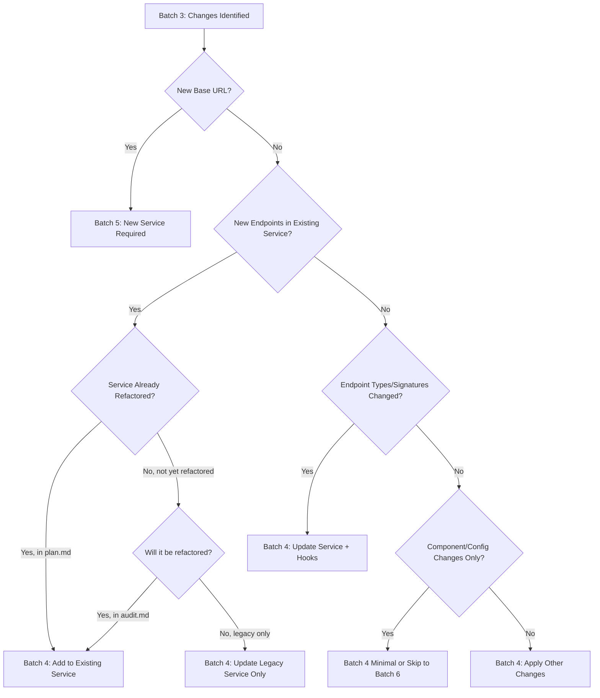
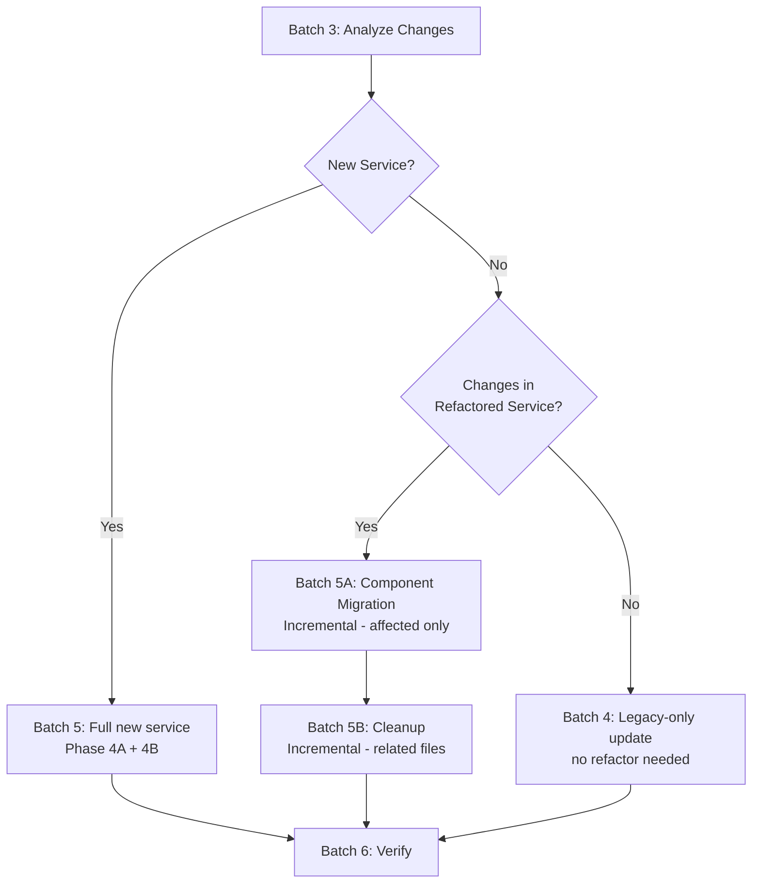

# Legacy Update Integration Guide

> **Purpose:** Quick reference for integrating legacy repo updates with the main service refactor lifecycle. Use this when legacy updates occur during active refactoring.

---

## Related Documents

- `refactor-spec.md` - Main refactor specification
- `refactor-batch-prompts.md` - Main refactor batch prompts
- `legacy-update-routines.md` - Detailed update routines
- `legacy-update-batch-prompts.md` - Copy-paste update prompts
- `component-migration.md` - Component migration tracking
- `refactor-lifecycle.md` - Visual lifecycle diagram
- `verification-gate.md` - Per-app verification commands

---

## When to Run Legacy Updates

Legacy updates can occur at **any time** during the refactor lifecycle. The risk level and workflow vary by phase:

| Current Refactor Phase                     | Risk Level  | Workflow                           | Notes                                      |
| ------------------------------------------ | ----------- | ---------------------------------- | ------------------------------------------ |
| **Before Batch 0** (Not started)           | ✅ Low      | Direct integration                 | Safe to integrate before starting refactor |
| **Batch 0-5** (Phases 0-4B)                | ⚠️ Medium   | Pause → Update → Resume            | Old and new services coexist               |
| **Batch 6** (Phase 5, Component Migration) | 🔴 High     | Pause → Update → Extensive Testing | Some components already migrated           |
| **Batch 7+** (Phase 6, After Cleanup)      | 🔴 Critical | Incremental refactor required      | Old services deleted, use Batch 5A + 5B    |

---

## Pause/Resume Workflow

### Before Running Legacy Update

**If currently in active refactor batch:**

1. **Complete current step** in main batch (don't stop mid-step)
2. **Document pause point** in task.md:

   ```markdown
   ## Current Status

   - Phase: <e.g., Phase 4B>
   - Batch: <e.g., Batch 5>
   - Status: ⏸️ Paused at step <e.g., "Creating hooks for claims service">
   - Reason: Legacy update incoming
   - Timestamp: <YYYY-MM-DD HH:MM>
   ```

3. **Commit and push** current work:
   ```bash
   git add .
   git commit -m "chore: pause main refactor for legacy update"
   git push origin migrate-app/<APP_NAME>
   ```
4. **Proceed** with legacy update Batch 1

### After Legacy Update Verification

**Once Batch 6 verification passes:**

1. **Update task.md**:

   ```markdown
   ## Current Status

   - Phase: <e.g., Phase 4B>
   - Batch: <e.g., Batch 5>
   - Status: ▶️ Resumed after legacy update
   - Legacy update: <timestamp> integrated successfully
   - Services affected: <list>
   - New services added: <list or "none">
   ```

2. **Review changes** that might affect current work:
   - Check if services you're currently refactoring were modified
   - Check if new endpoints were added to services you've already implemented
   - Check if dependencies changed

3. **Cross-Track Impact Review (if component migration is active):**

   > [!IMPORTANT]
   > Before resuming either track, verify the legacy update didn't invalidate in-progress work on the other track:
   - Did this update modify a service currently being consumed by a component in the component migration batch? → Verify hooks/types still valid before component migration resumes
   - Did this update add new endpoints to an already-refactored service? → Extend hooks before the next component migration step
   - Did this update touch a component with `Status=IN PROGRESS` in `apps/<APP_NAME>/docs/migration/component/_output/_migration-log.md`? -> Notify the component migration agent to re-verify that component
   - Document impact (or `cross-track impact: none`) in `legacy-updates/legacy-update-YYYYMMDD-HHMMSS.md`

4. **Resume main batch** from documented step

---

## Decision Tree: Batch 4 vs Batch 5

**After running Batch 3 (Analyze Changes), use this decision tree:**



### Decision Matrix

| Scenario                             | Indicators                               | Recommended Batch             | Example                                           |
| ------------------------------------ | ---------------------------------------- | ----------------------------- | ------------------------------------------------- |
| **New service**                      | Base URL not in `audit.md`               | **Batch 5**                   | New `NEXT_PUBLIC_NOTIFICATION_SERVICE_URL`        |
| **New endpoints (existing service)** | Base URL exists in `audit.md`, new paths | **Batch 4**                   | Adding `/v1/claims/bulk-approve` to Claim Service |
| **Modified endpoint types**          | Endpoint in `plan.md`, types changed     | **Batch 4**                   | Claim response now includes `approver: User`      |
| **Breaking API changes**             | Endpoint signature changed               | **Batch 4** + careful testing | `/v1/claims` now requires `channel_id` param      |
| **Component changes only**           | No service files changed                 | **Batch 4** (minimal)         | Added new UI fields to claim form                 |
| **Config/dependency changes**        | `package.json`, `.env`, build config     | **Batch 4** (minimal)         | Added `zod` dependency                            |

---

## Batch Sequence Mapping

### Scenario A: Clean Update (No Conflicts, No New Services)

**Batch Sequence:** 1 → 3 → 4 → 6  
**Time:** 30 min - 1 hour  
**Use When:** Simple endpoint additions or minor updates

```
Batch 1: Subtree pull to integrate/<APP_NAME> and merge to migrate-app/<APP_NAME>
         ↓ (no conflicts)
Batch 3: Analyze changes → identify new endpoints in existing service
         ↓ (decision: Batch 4)
Batch 4: Add endpoints to service API layer + create/update hooks
         ↓
Batch 6: Verify + document
```

---

### Scenario B: Update with Conflicts (No New Services)

**Batch Sequence:** 1 → 2 → 3 → 4 → 6  
**Time:** 1-2 hours  
**Use When:** Legacy and refactored code overlap

```
Batch 1: Subtree pull to integrate/<APP_NAME> and merge to migrate-app/<APP_NAME>
         ↓ (conflicts detected)
Batch 2: Resolve conflicts using categorization strategy
         ↓
Batch 3: Analyze changes
         ↓ (decision: Batch 4)
Batch 4: Apply adjustments
         ↓
Batch 6: Verify + document
```

---

### Scenario C: Update with New Service

**Batch Sequence:** 1 → 3 → 5 → 6  
**Time:** 2-4 hours  
**Use When:** New base URL detected

```
Batch 1: Subtree pull to integrate/<APP_NAME> and merge to migrate-app/<APP_NAME>
         ↓ (clean or after conflict resolution)
Batch 3: Analyze changes → detect new base URL
         ↓ (decision: Batch 5)
Batch 5: Create new service (Phase 4A + 4B)
         - Update audit.md and plan.md
         - Implement API layer
         - Implement hooks + hook barrel files (`hooks/queries/index.ts`, `hooks/mutations/index.ts`)
         - Run verification gate
         ↓
Batch 6: Verify + document
```

---

### Scenario D: Update During Phase 5 (Component Migration)

**Batch Sequence:** 1 → 2 (high probability) → 3 → 4 → 6 (extensive testing)  
**Time:** 2-4 hours  
**Risk:** 🔴 High - requires careful testing  
**Use When:** Legacy update occurs while actively migrating components

```
Batch 1: Subtree pull and merge
         ↓ (conflicts likely on partially migrated components)
Batch 2: Resolve conflicts carefully
         - Migrated components → keep ours
         - Non-migrated components → accept theirs
         - Check imports to determine migration status
         ↓
Batch 3: Analyze changes
         ↓
Batch 4: Apply adjustments
         - May need to update recently migrated components
         - Re-test all migrated components affected by changes
         ↓
Batch 6: Extensive verification
         - Test all migrated components
         - Test all affected user flows
         - May need to re-migrate some components
```

---

### Scenario E: Update After Cleanup (Phase 6 Complete)

**Batch Sequence:** 1 → 3 → 5 → 5A → 5B → 6  
**Time:** 2-4 hours  
**Risk:** 🔴 Critical - no old services to fall back on  
**Use When:** Legacy update occurs after old services are deleted

```
Batch 1: Subtree pull and merge
         ↓
Batch 3: Analyze changes
         ↓ (Incremental refactor MANDATORY)
Batch 5: New Service API + Hooks
         - Create the new base-URL service first
         - No component migration yet
         ↓
Batch 5A: Component Migration (Incremental)
         - Migrate ONLY affected components to new service
         - Use component-migration.md to track
         - No legacy fallback available
         ↓
Batch 5B: Cleanup (Incremental)
         - Remove ONLY related old service files
         - Update imports in affected components
         ↓
Batch 6: Verify + document
```

**Key Difference from Scenario C:**

- Scenario C (pre-cleanup): Batch 5 may stop after API + hooks if components still use old services
- Scenario E (post-cleanup): Batch 5 is still required, and must be followed immediately by 5A + 5B

---

### Post-Cleanup Decision Tree (After Batch 7 Complete)

**When Batch 7 is complete and new legacy update arrives:**



**Decision Rules:**

1. **New base URL** → Full Batch 5 (same as Scenario C)
2. **Existing refactored service** → Batch 5A (component migration) + 5B (cleanup)
3. **Legacy-only changes** → Batch 4 minimal

---

## Common Questions

### Q: What if verification fails in Batch 6?

**A:** Use fix-first approach:

1. Diagnose the issue (use `$systematic-debugging` if available)
2. Fix in the most localized way
3. Re-run Batch 6 verification
4. If fix is safe and passes, continue
5. If fix is not safe or would expand scope, consider rollback:
   ```bash
   git branch backup/migrate-app-<APP_NAME>-pre-legacy-update
   git revert <commit-or-merge-commit>
   ```
6. Document failure and plan alternative approach

If a destructive reset seems necessary, stop and coordinate manually rather than force-pushing by default.

### Q: How do I know which components are migrated vs non-migrated during Batch 2?

**A:** Check component imports:

- **Migrated:** Uses `import { useXxx } from '@/services/.../hooks/queries'` or `import { useXxxMutation } from '@/services/.../hooks/mutations'` (barrel imports)
- **Non-migrated:** Uses old service imports like `import { claimService } from '@/services/claim.service'`

Also check recent task.md or commit history for component migration checklist.

### Q: Can I skip Batch 3 if changes are obvious?

**A:** No. Batch 3 is mandatory because:

- Creates audit trail (`legacy-update-YYYYMMDD-HHMMSS.md`)
- Documents impact assessment
- Provides decision justification for Batch 4 vs 5

### Q: What if legacy update introduces breaking dependency changes?

**A:** Treat as Batch 4 (minimal):

1. Update `package.json` as merged
2. Run `pnpm install`
3. Fix any type errors or build issues
4. Run full verification gate
5. Document in `legacy-update-YYYYMMDD-HHMMSS.md`

---

## Checklist: Before Starting Legacy Update

> [!IMPORTANT]
> **Cross-Track State Check (if running parallel migrations):** Before starting, record the current state of BOTH tracks:
> - **Service migration:** Current phase and batch (e.g., "Phase 4B / Batch 5 — paused at claims hooks")
> - **Component migration:** Current batch and last completed component (e.g., "Batch 1.5 — paused after SoC split of ClaimsForm")
> This snapshot is required to correctly restore both tracks after the legacy update.

Use this checklist before running Batch 1:

- [ ] Legacy repo has new commits confirmed
- [ ] Working tree is clean: `git status`
- [ ] Current main refactor batch at a good stopping point (step completed)
- [ ] Pause point documented in `task.md` (if applicable)
- [ ] Git subtree remotes configured correctly
- [ ] `verification-gate.md` exists at `<APP_PATH>/docs/migration/verification-gate.md`
- [ ] **If component migration active:** Check `apps/<APP_NAME>/docs/migration/component/_output/_migration-log.md` for components with `Status=DONE` (needed for correct conflict resolution)
- [ ] Team notified (if applicable)

---

## Quick Reference: Which Prompt to Use

| Situation                         | Use This Prompt | When                            |
| --------------------------------- | --------------- | ------------------------------- |
| Starting legacy update            | Batch 1         | Always                          |
| Conflicts after merge             | Batch 2         | If conflicts detected           |
| Analyzing what changed            | Batch 3         | Always                          |
| Updating existing services        | Batch 4         | Existing endpoints/types        |
| Creating new service (full)       | Batch 5         | New base URL                    |
| Component migration (incremental) | Batch 5A        | After Batch 7, existing service |
| Cleanup (incremental)             | Batch 5B        | After Batch 5A                  |
| Final verification                | Batch 6         | Always                          |

**Post-Cleanup Flow:**

- New service → Batch 1 → 3 → **5** → 6
- Existing service → Batch 1 → 3 → **5A** → **5B** → 6

---

## Summary

✅ **Safe Integration** - Conflicts only on `migrate-app/<APP_NAME>`, never on `integrate/<APP_NAME>`  
✅ **Phase-Aware** - Different workflows for different refactor phases  
✅ **No Breaking Changes** - Verification at every step  
✅ **Incremental Growth** - New services refactored incrementally  
✅ **Full Traceability** - All updates tracked and logged  
✅ **Clear Decisions** - Decision tree for Batch 4 vs Batch 5
