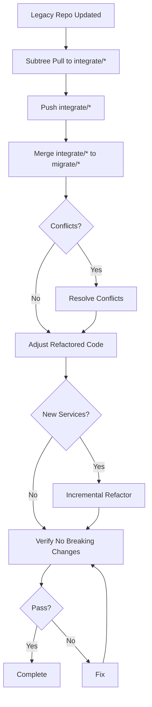

# Legacy Repo Update Routines

> **Purpose:** This document defines the routines and workflows for handling updates from legacy repositories via git subtree pull operations during the monorepo migration. This ensures refactored apps remain synchronized with their legacy repos while maintaining no breaking changes.

---

## Related Documents

- `apps/<app-name>/docs/migration/service/refactor-spec.md`
- `apps/<app-name>/docs/migration/service/refactor-lifecycle.md`
- `apps/<app-name>/docs/migration/service/refactor-batch-prompts.md`
- `apps/<app-name>/docs/migration/service/legacy-update-batch-prompts.md`
- `apps/<app-name>/docs/migration/service/component-migration.md`
- `apps/<app-name>/docs/migration/service/audit.md`
- `apps/<app-name>/docs/migration/service/plan.md`
- `apps/<app-name>/docs/verification-gate.md`

---

## Overview

### Context

During monorepo migration, each app in `apps/` maintains two branch types:

- **`integrate/*`** = Read-only baseline branch (1:1 copy of legacy repo via git subtree)
- **`migrate/*`** = Work/refactor branch created from `integrate/*`

**Key principle:** The `integrate/*` branch is 1:1 with the legacy repo and never has local modifications. Therefore, subtree pull to `integrate/*` will NEVER have conflicts. Conflicts only occur when merging `integrate/*` to `migrate/*`.

> [!IMPORTANT]
> **All legacy update documentation and refactoring work** happens on the `migrate/*` branch, NOT on `integrate/*`. The `integrate/*` branch remains untouched except for git subtree pull operations.

### Goals

1. **Synchronization** - Keep monorepo apps updated with legacy repo changes
2. **No Breaking Changes** - Maintain refactored functionality during updates
3. **Conflict Resolution** - Handle merge conflicts on `migrate/*` systematically
4. **Adjustment Integration** - Incorporate new services/features into refactored architecture

### When to Apply These Routines

**Legacy update routines are independent of refactor phases** and can be applied at ANY time during migration:

- ✅ **Before Phase 0** (before starting refactor) - Safe to integrate
- ✅ **During Phase 0-4B** (before component migration) - Lower risk, old and new services coexist
- ✅ **During Phase 5** (component migration) - Higher risk, test migrated components carefully
- ✅ **After Phase 6** (cleanup complete) - Must immediately refactor into new architecture

**Key principle:** The routines adapt based on which phase the app is currently in. See "Integration with Main Refactor Lifecycle" section for phase-specific guidance.

---

## Routine Overview



---

## Routine 1: Subtree Pull to integrate/\* (Baseline Update)

### Objective

Pull latest changes from legacy repo into the read-only `integrate/*` branch.

### Pre-conditions

- Legacy repo has new commits
- Clean working tree
- `integrate/*` is 1:1 with legacy repo (never modified)

### Steps

#### 1.1 Switch to integrate/\* branch

```bash
git checkout integrate/<app-name>
```

#### 1.2 Perform subtree pull

```bash
# No conflicts expected since integrate/* is 1:1 with legacy
git subtree pull --prefix=apps/<app-name> <remote-name> <remote-branch>
```

**Expected:** Clean merge (100% of the time)

**If conflicts occur:** `integrate/*` was modified (should NEVER happen). Investigate and fix.

#### 1.3 Push integrate/\* branch

```bash
git push origin integrate/<app-name>
```

---

## Routine 2: Merge integrate/_ to migrate/_ (Sync Refactored Branch)

### Objective

Synchronize the refactored `migrate/*` branch with the updated baseline.

### Pre-conditions

- `integrate/*` successfully updated and pushed
- Clean working tree

### Steps

#### 2.1 Switch to migrate/\* branch

```bash
git checkout migrate/<app-name>
```

#### 2.2 Merge integrate/_ into migrate/_

```bash
git merge integrate/<app-name>
```

**Expected Outcomes:**

- ✅ **No conflicts**: Clean merge → skip to Routine 4
- ⚠️ **Conflicts**: Conflicts detected → proceed to Routine 3

#### 2.3 Push migrate/\* branch (if no conflicts)

```bash
git push origin migrate/<app-name>
```

---

## Routine 3: Resolve Conflicts on migrate/\* (Refactor Conflicts)

### Objective

Resolve conflicts between legacy updates and refactored code.

### Pre-conditions

- Merge from `integrate/*` to `migrate/*` resulted in conflicts

### Steps

#### 3.1 Identify conflict categories

```bash
git status
git diff --name-only --diff-filter=U
```

Analyze conflicted files based on **conceptual categories**, not specific paths (since each app may have different structure):

**Conflict Categories:**

| Category                    | Description                                                                 | Resolution Strategy          |
| --------------------------- | --------------------------------------------------------------------------- | ---------------------------- |
| **Old/Legacy Services**     | Files that will be deleted in Phase 6 cleanup (services not yet refactored) | Accept incoming (legacy)     |
| **New/Refactored Services** | Files created during refactoring (new architecture)                         | Keep ours (refactored)       |
| **Migrated Components**     | Components already using new service hooks                                  | Keep ours                    |
| **Non-Migrated Components** | Components still using old services                                         | Accept incoming (legacy)     |
| **Shared Infrastructure**   | Foundation code (API clients, query setup, utils)                           | Carefully merge, prefer ours |
| **Configuration**           | Config files (package.json, tsconfig, env, etc.)                            | Carefully merge both         |

**How to categorize a conflicted file:**

1. Check if file is part of **new refactored structure** (created during Phase 4A/4B) → New/Refactored Services
2. Check if file is **old service** that will be deleted → Old/Legacy Services
3. Check if file is **component/page**:
   - Look at imports: uses new hooks? → Migrated Component
   - Still uses old services? → Non-Migrated Component
4. Check if file is **infrastructure** (libs, shared code) → Shared Infrastructure
5. Otherwise, likely **configuration** → Configuration

**Determining Migration Status Mid-Refactor:**

If you're unsure which category a file belongs to (especially during Phase 5 component migration):

1. **Check current refactor phase** in `<APP_PATH>/docs/migration/service/plan.md` or task.md
2. **Identify migrated components:**
   - Check recent task.md checklist for migrated component list
   - Check recent commit messages for "migrate component: ..."
   - View component imports: new hooks = migrated, old services = not migrated
3. **For service files:**
   - Check if service exists in `src/services/<service-name>/` → New/Refactored
   - Otherwise, check if in old location (e.g., `src/services/*.service.ts`) → Old/Legacy

#### 3.2 Resolve conflicts by category

**A. Old/Legacy Service Files**

For files that will be deleted in Phase 6:

```bash
# Accept legacy changes
git checkout --theirs <file>
git add <file>
```

**B. New/Refactored Service Files**

For files created during refactoring:

```bash
# Keep refactored version
git checkout --ours <file>
git add <file>
```

**C. Components/Pages**

Check migration status by looking at imports:

- **If migrated** (uses new hooks like `import { useXxx } from '@/services/.../hooks/...'`):

  ```bash
  git checkout --ours <file>
  ```

- **If not migrated** (still uses old services):
  ```bash
  git checkout --theirs <file>
  ```

**D. Shared Infrastructure**

Manually merge, preferring our refactored infrastructure but integrating safe legacy improvements.

**E. Configuration Files**

Manually merge:

- Combine dependencies from both
- Keep monorepo-specific configurations
- Integrate legacy improvements if safe

#### 3.3 Commit and push

```bash
git add .
git commit -m "chore: merge integrate/<app-name> to migrate/<app-name>"
git push origin migrate/<app-name>
```

---

## Routine 4: Adjust Refactored Code for New Changes

### Objective

Integrate new services, features, or breaking changes from legacy repo.

### Pre-conditions

- `migrate/*` merged successfully
- No unresolved conflicts

### Steps

#### 4.1 Identify new changes

```bash
# Check what changed
git log integrate/<app-name>~5..integrate/<app-name> --oneline
git diff <previous-integrate-commit> integrate/<app-name> --name-status
```

**Look for:**

- ✨ New service endpoints
- ✨ New API calls
- ✨ New types/interfaces
- 🔧 Modified business logic
- 🔧 Modified API contracts
- ⚠️ Breaking dependency changes

#### 4.2 Categorize adjustments

| Change Type                  | Action                   | Proceed to |
| ---------------------------- | ------------------------ | ---------- |
| New endpoints (same service) | Add to existing service  | 4.3.A      |
| New service (new base URL)   | Create new service       | 4.3.B      |
| Modified endpoints           | Update API layer + types | 4.3.C      |
| Component changes only       | No refactor needed       | 4.4        |
| Breaking dependency changes  | Update + fix             | 4.4        |

#### 4.3 Apply incremental refactoring

**A. Add endpoints to existing service**

1. Add to `[service].endpoints.ts`
2. Add types to `[service].types.ts`
3. Add function to `[service].service.ts`
4. Update `query-keys.ts`
5. Create hooks in `hooks/queries/` or `hooks/mutations/`

**B. Create new service** (see Routine 5)

**C. Update existing endpoints**

1. Update types in `[service].types.ts`
2. Update function in `[service].service.ts`
3. Update affected hooks
4. Check migrated components for breaking changes

#### 4.4 Handle non-service changes

```bash
# Install new dependencies
pnpm install <package>
```

- Config changes: Already merged
- Business logic: Apply to appropriate location

---

## Routine 5: Incremental Refactor for New Services

### Objective

Refactor new services added from legacy into the new architecture.

### When to Apply

- ✅ New base URL detected
- ✅ New service domain added
- ✅ Significant new endpoints

### When to Skip

- Minor endpoint additions → use Routine 4.3.A
- Component-only changes

### Steps

#### 5.1 Update audit document

```markdown
# In apps/<app-name>/docs/migration/service/audit.md

## Service: <new-service-name>

### Base URL

- `<BASE_URL>`

### Endpoints

- List all

### Types

- List all

### Current State

- Status: NEW (from legacy update YYYY-MM-DD)
- Complexity: Low/Medium/High
```

#### 5.2 Update refactoring plan

```markdown
# In apps/<app-name>/docs/migration/service/plan.md

## Service: <new-service-name>

- Base URL: `<BASE_URL>`
- Endpoints: (list)
- Types: (list)
- Query keys: (outline)
- Hooks: (list queries + mutations)
```

#### 5.3 Implement Phase 4A (API Layer)

Create `apps/<app>/src/services/<service>/api/`:

- `[service].endpoints.ts`
- `[service].types.ts`
- `[service].service.ts`

#### 5.4 Implement Phase 4B (Hooks)

Create:

- `query-keys.ts`
- `hooks/queries/*`
- `hooks/mutations/*`

#### 5.5 Run verification gate

After both Phase 4A and 4B.

---

## Routine 5A: Component Migration for New Service (Incremental)

### Objective

Migrate ONLY components that need the newly created service (typically after main Batch 6-7 complete).

### When to Apply

- ✅ After Routine 5 completes (new service API + hooks created)
- ✅ After main refactor Batch 6 or 7 (component migration started/completed)
- ✅ When components exist that should use the new service
- ❌ Skip if before main Batch 6 (components still use old services)

### When to Skip

- Before main component migration phase (Batch 6)
- No components need the new service yet
- Service is for future use only

### Steps

#### 5A.1 Identify affected components

Search codebase for components that:

- Currently use old service patterns related to new service domain
- Make API calls related to new service endpoints
- Would benefit from the new service

**Methods:**

```bash
# Search for old API calls
grep -r "<endpoint-pattern>" apps/<app>/src/

# Search for old service imports
grep -r "import.*<old-service-name>" apps/<app>/src/

# Check component directories
find apps/<app>/src/components -name "*.tsx" -o -name "*.ts"
find apps/<app>/src/pages -name "*.tsx" -o -name "*.ts"
```

Create list of affected components (pages, forms, dashboards, etc.)

#### 5A.2 Migrate components incrementally

**For EACH component** (one at a time):

1. **Backup approach**: Commit current state before migrating
2. **Update imports**:

   ```typescript
   // ❌ Remove old patterns
   import { useUpdateNew } from '@/services/new-service/hooks/mutations/useUpdateNew';
   // ✅ Add new hooks
   import { useNewData } from '@/services/new-service/hooks/queries/useNewData';
   import { oldService } from '@/services/old.service';
   ```

3. **Replace data fetching**:

   ```typescript
   // ❌ Old pattern
   const [data, setData] = useState([]);
   const [loading, setLoading] = useState(false);

   useEffect(() => {
     const fetchData = async () => {
       setLoading(true);
       const result = await oldService.getData();
       setData(result);
       setLoading(false);
     };
     fetchData();
   }, []);

   // ✅ New pattern
   const { data, isLoading } = useNewData({ filters });
   ```

4. **Replace mutations**:

   ```typescript
   // ❌ Old pattern
   const handleSubmit = async (values) => {
     setLoading(true);
     await oldService.update(values);
     setLoading(false);
     refetch(); // manual refetch
   };

   // ✅ New pattern
   const { mutate, isPending } = useUpdateNew();

   const handleSubmit = (values) => {
     mutate(values, {
       onSuccess: () => {
         // automatic cache invalidation
       }
     });
   };
   ```

5. **Update loading/error states**:

   ```typescript
   // ✅ Use hook states
   if (isLoading) return <Spinner />;
   if (error) return <ErrorMessage error={error} />;
   ```

6. **Test component thoroughly**:
   - Page loads without errors
   - Data fetching works correctly
   - User interactions work
   - No console/network errors
   - No regressions

7. **Commit after each component** if successful

#### 5A.3 Verify each migration

After each component migration:

```bash
# Typecheck
pnpm typecheck

# Build (if fast enough)
pnpm build

# Manual test
# - Open page in browser
# - Test all interactions
# - Check network tab
# - Check console
```

#### 5A.4 After all components migrated

Run full verification gate as defined in `apps/<app-name>/docs/verification-gate.md`.

#### 5A.5 Document results

**In `legacy-updates/legacy-update-YYYYMMDD-HHMMSS.md`**, add:

```markdown
## Component Migration (Routine 5A)

### Components Migrated

- `<component-1>` - Description
- `<component-2>` - Description

### Patterns Applied

- Replaced useState + useEffect with useQuery
- Replaced manual mutations with useMutation hooks
- Automatic cache invalidation

### Verification

- All migrated components tested: ✅
- No regressions detected: ✅
```

**Also update `component-migration.md`** for centralized tracking:

In `apps/<app-name>/docs/migration/service/component-migration.md`, add new section under "Incremental Updates":

```markdown
### Update: YYYY-MM-DD HH:MM ([Service Name] - Batch 5A)

**Context:** [Brief description of what was added from legacy repo]

**Legacy Update Reference:** [`legacy-updates/legacy-update-YYYYMMDD-HHMMSS.md`](./legacy-updates/legacy-update-YYYYMMDD-HHMMSS.md)

**New Service Created:** `[service-name]`

**Components Migrated:**

- [x] `src/path/to/component.tsx` - [Description]
  - **Before:** [Old pattern]
  - **After:** [New hook from new service]
  - **Verified:** ✅

**Verification:** ✅ All passed (Typecheck, Build, Tests, Sanity)

**Issues:** None / [Describe if any]
```

---

## Routine 5B: Incremental Cleanup for New Service

### Objective

Remove ONLY old service files related to newly created service (if any exist).

### When to Apply

- ✅ After Routine 5A completes (components migrated to new service)
- ✅ When old service files exist for the same domain
- ❌ Skip if no old service exists for this domain
- ❌ Skip if before main Batch 6 (old services still needed by other components)

### When to Skip

- No old service exists for this domain (e.g., brand new service from legacy)
- Before main cleanup phase (Batch 7)
- Old services still used by other components

### Steps

#### 5B.1 Identify old service files

Search for old service files related to new service domain:

```bash
# Search for old service files
find apps/<app>/src/services -name "*<service-name>*.ts"

# Check for old API clients
grep -r "<old-service-name>" apps/<app>/src/services/

# List potential files to delete
ls -la apps/<app>/src/services/*<service-name>*
```

Common patterns:

- `src/services/<old-service-name>.service.ts`
- `src/services/<old-service-name>.ts`
- `src/api/<old-service-name>.ts`
- `src/utils/<old-service-name>-client.ts`

#### 5B.2 Delete old service files (if exist)

**If old service files found:**

```bash
# Delete ONLY files related to new service
rm apps/<app>/src/services/<old-service-name>.service.ts

# Update any remaining imports (should be none if 5A was complete)
# Check for broken imports:
pnpm typecheck
```

**Rules:**

- **ONLY** delete files related to new service domain
- **DO NOT** delete other old services (may be used elsewhere)
- **DO NOT** delete shared utilities unless verified unused

**If no old service files found:**

Document: "No cleanup needed, old service doesn't exist (brand new service)"

#### 5B.3 Verify cleanup

```bash
# Typecheck
pnpm typecheck

# Build
pnpm build

# Verify no broken imports
# Verify app still runs
```

#### 5B.4 Run verification gate

Run full verification gate from `verification-gate.md`.

#### 5B.5 Document cleanup

In `legacy-updates/legacy-update-YYYYMMDD-HHMMSS.md`, add:

```markdown
## Cleanup (Routine 5B)

### Files Deleted

- `src/services/<old-service-name>.service.ts`
- (or "None - old service didn't exist")

### Verification

- Typecheck: ✅
- Build: ✅
- No broken imports: ✅
```

---

## Routine 6: Verify No Breaking Changes

### Objective

Ensure legacy updates didn't break refactored functionality.

### Steps

#### 6.1 Run verification gate

Run the verification gate as defined in `apps/<app-name>/docs/verification-gate.md`.

This typically includes:

- Typecheck
- Build
- Lint
- Tests (if available)
- Sanity checks (if defined)

#### 6.2 Verify refactored services

- Queries return expected data
- Mutations work
- Cache invalidation works
- Error handling works

#### 6.3 Verify migrated components

- Rendering works
- Data fetching works
- User interactions work
- No regressions

#### 6.4 If verification fails catastrophically

If verification fails and cannot be fixed safely:

```bash
# Rollback migrate/* branch
git reset --hard <commit-before-legacy-update-merge>
git push -f origin migrate/<app-name>
```

Document rollback in `legacy-update-YYYYMMDD-HHMMSS.md` and notify team.

#### 6.5 Update task.md

If main task.md exists at `apps/<app-name>/docs/migration/service/task.md`:

- Mark legacy update as integrated
- Update current phase/batch status
- Note services affected and new services added

> [!NOTE]
> All documentation is created on the `migrate/<app-name>` branch, NOT on `integrate/*`.

#### 6.6 Document results

Create `apps/<app-name>/docs/migration/service/legacy-updates/legacy-update-YYYYMMDD-HHMMSS.md` (use actual datetime):

```markdown
# Legacy Update - <app-name> - YYYY-MM-DD HH:MM:SS

## Legacy Commit

- SHA: <sha>
- Date: <date>
- Summary: <what changed>

## Integration

- Subtree pull: ✅
- Merge to migrate/\*: ✅ Clean / ⚠️ Conflicts resolved
- New services: <list or none>
- Modified endpoints: <list or none>

## Verification

- Typecheck: ✅/❌
- Build: ✅/❌
- Tests: ✅/❌/N/A
- Sanity: ✅/❌

## Actions

- <what was done>

## Current Refactor Phase

- App is currently at: Batch X (Phase Y)
- Services refactored: <list>
- Components migrated: <count or list>
```

**Note:** Each legacy update gets its own timestamped file for traceability.

---

## Common Scenarios

### Scenario A: Clean Update (No Conflicts, No New Services)

**Flow:** Routine 1 → Routine 2 → Routine 4 (minimal) → Routine 6  
**Time:** 30 min - 1 hour

### Scenario B: Update with Conflicts (No New Services)

**Flow:** Routine 1 → Routine 2 → Routine 3 → Routine 4 (minimal) → Routine 6  
**Time:** 1-2 hours

### Scenario C: Update with New Service

**Flow:** Routine 1 → Routine 2 → Routine 3 (if conflicts) → Routine 4 → Routine 5 → Routine 6  
**Time:** 2-4 hours

### Scenario D: Update with Breaking Changes

**Flow:** Routine 1 → Routine 2 → Routine 3 → Routine 4 (extensive) → Routine 6  
**Time:** 3-6 hours

---

### Scenario E: New Service After Full Cleanup

**Flow:** Routine 1 → Routine 2 → Routine 3 (if conflicts) → Routine 4 → Routine 5 → Routine 5A → Routine 5B → Routine 6  
**Time:** 3-5 hours

**Context:** Main refactor complete (Batch 0-7 done), old services deleted, now legacy update adds new service.

**Key Difference:** After cleanup, MUST immediately migrate components (Routine 5A) - cannot leave components using non-existent old services.

**Steps:**

1. Routine 1-3: Subtree pull, merge, resolve conflicts (if any)
2. Routine 4: Identify new service needed
3. Routine 5: Create new service (API + Hooks - Phase 4A + 4B)
4. **Routine 5A**: Migrate ONLY components that need the new service (incremental Phase 5)
5. **Routine 5B**: Cleanup old service files (if legacy added old-style service) (incremental Phase 6)
6. Routine 6: Full verification

**DO NOT** re-run main Batch 6-7 from scratch - use incremental Routines 5A/5B instead.

---

## Best Practices

1. **integrate/\* is sacred** - Never modify it directly
2. **Document everything** - Create/update `legacy-updates/legacy-update-YYYYMMDD-HHMMSS.md`
3. **Run verification** after every integration
4. **Incremental only** - Don't rush component migration
5. **Communicate** - Notify team of breaking changes
6. **Document pause/resume** - Update task.md when pausing/resuming main refactor
7. **Verify verification-gate.md exists** - Before Batch 6, ensure verification commands are defined

### Conflict Resolution Priority

1. New/refactored services (core architecture)
2. Shared infrastructure (foundation)
3. Migrated components (already using new architecture)
4. Old/legacy services (temporary, will be deleted)

### When to Pause Refactoring

- ⚠️ Breaking API changes
- ⚠️ Core dependency changes
- ⚠️ Significant build config changes
- ⚠️ Multiple apps need same update

---

## Integration with Main Refactor Lifecycle

### Before Batch 0

- Ensure `integrate/*` is up to date
- Run routines 1-6 if needed

### During Batch 0-5 (Before Component Migration; covers Phases 0-4B)

1. Pause current batch
2. Run routines 1-6
3. Resume batch

### During Batch 6 (Component Migration; Phase 5)

1. **Higher risk** - test migrated components carefully
2. May need to re-migrate affected components

### After Batch 7 (Cleanup; Phase 6)

1. No old services to fall back on
2. **Must use incremental routines** for new service:
   - Run Routines 1-4 (subtree, merge, analyze, adjust)
   - Run **Routine 5** (create new service - API + Hooks)
   - Run **Routine 5A** (migrate affected components incrementally)
   - Run **Routine 5B** (cleanup if old service was added from legacy)
   - Run Routine 6 (verification)
3. **DO NOT** re-run main Batch 6-7 (would migrate all components from scratch)
4. **DO** use Routine 5A to migrate ONLY affected components
5. Full verification is mandatory (Routine 6)

---

## Pause/Resume Workflow

### Before Running Legacy Update

**If currently in active refactor batch:**

1. **Complete current step** in main batch (don't stop mid-step)
2. **Document pause point** in task.md (if task.md exists):

   ```markdown
   ## Current Status

   - Phase: <e.g., Phase 4B>
   - Batch: <e.g., Batch 5>
   - Status: ⏸️ Paused at step <e.g., "Creating hooks for claims service">
   - Reason: Legacy update incoming
   - Timestamp: <YYYY-MM-DD HH:MM>
   ```

3. **Commit and push** current work:
   ```bash
   git add .
   git commit -m "chore: pause main refactor for legacy update"
   git push origin migrate/<app-name>
   ```
4. **Proceed** with legacy update Routine 1

### After Legacy Update Verification

**Once Routine 6 verification passes:**

1. **Update task.md** (if exists):

   ```markdown
   ## Current Status

   - Phase: <e.g., Phase 4B>
   - Batch: <e.g., Batch 5>
   - Status: ▶️ Resumed after legacy update
   - Legacy update: <timestamp> integrated successfully
   - Services affected: <list>
   - New services added: <list or "none">
   ```

2. **Review changes** that might affect current work:
   - Check if services you're currently refactoring were modified
   - Check if new endpoints were added to services you've already implemented
   - Check if dependencies changed
3. **Resume main batch** from documented step

---

## Checklist Template

```markdown
## Legacy Update - <app-name> - YYYY-MM-DD

- [ ] Routine 1: Subtree pull to integrate/\*
  - [ ] Clean merge
  - [ ] Pushed

- [ ] Routine 2: Merge to migrate/\*
  - [ ] Conflicts: Yes/No
  - [ ] Pushed

- [ ] Routine 3: Resolve conflicts (if applicable)
  - [ ] Conflicts resolved
  - [ ] Pushed

- [ ] Routine 4: Adjust refactored code
  - [ ] New changes identified
  - [ ] Adjustments applied

- [ ] Routine 5: Incremental refactor (if new service)
  - [ ] API layer: ✅/N/A
  - [ ] Hooks: ✅/N/A

- [ ] Routine 6: Verify
  - [ ] Typecheck: ✅/❌
  - [ ] Build: ✅/❌
  - [ ] Tests: ✅/❌/N/A
  - [ ] Sanity: ✅/❌

- [ ] Documentation
  - [ ] Created legacy-updates/legacy-update-YYYYMMDD-HHMMSS.md
  - [ ] Updated audit.md (if needed)
  - [ ] Updated plan.md (if needed)
```

---

## Summary

✅ **Safe Integration** - Conflicts only on `migrate/*`, never on `integrate/*`  
✅ **No Breaking Changes** - Verification at every step  
✅ **Incremental Growth** - New services refactored incrementally  
✅ **Full Documentation** - All updates tracked and logged
