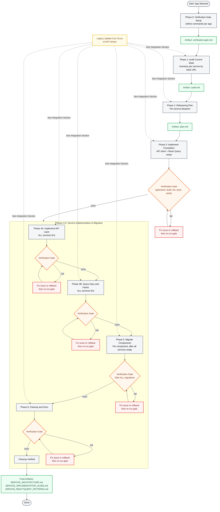
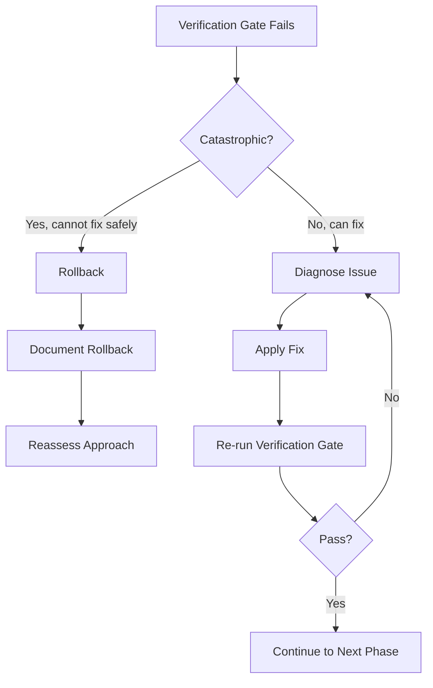
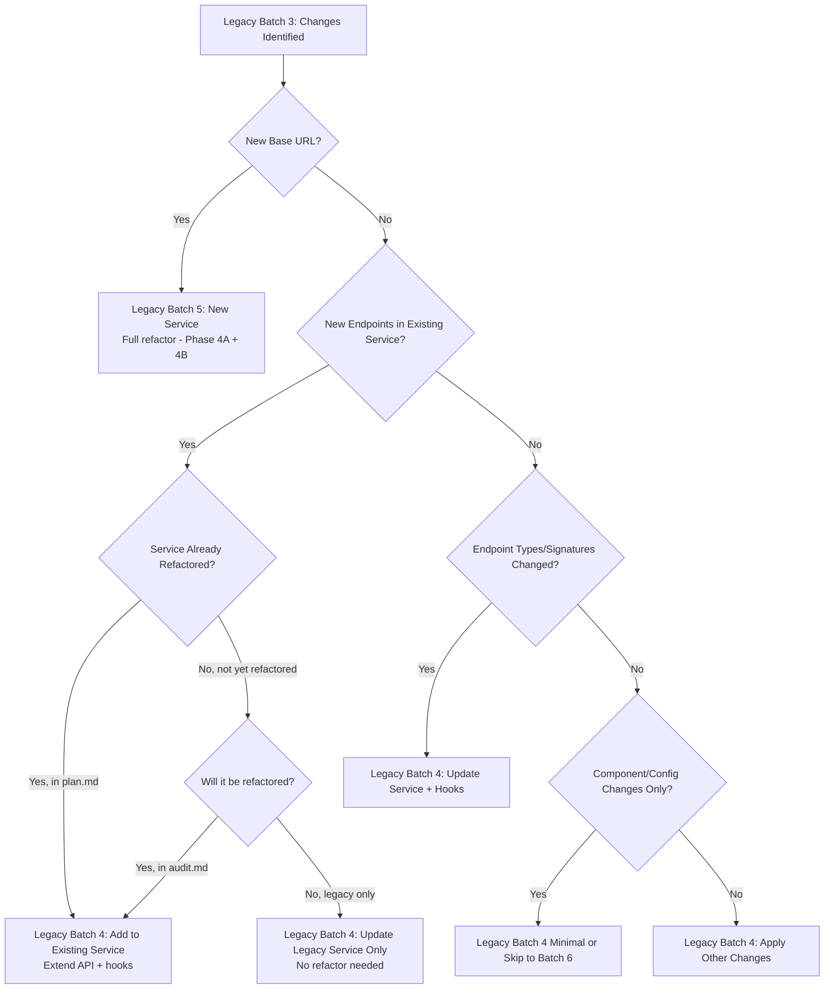
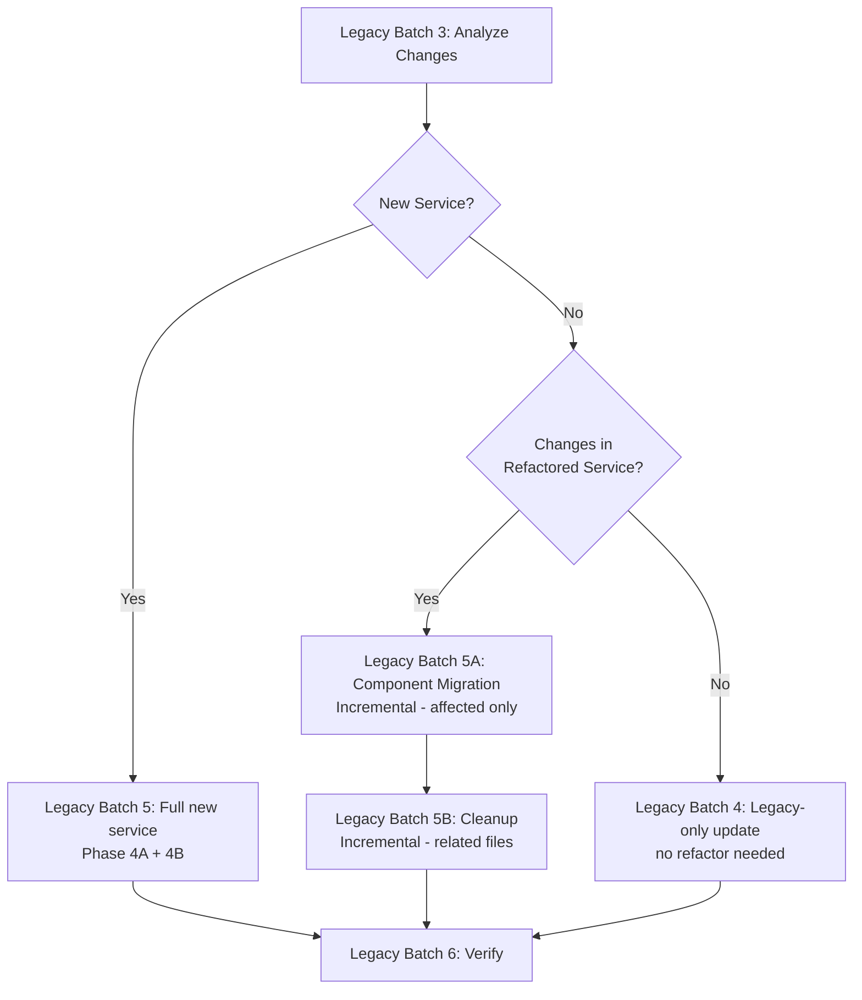

# Service Refactor Lifecycle

> **Purpose:** Visual and procedural guide for the complete service layer refactoring lifecycle. This document provides comprehensive phase details, decision trees, verification requirements, and integration workflows for multi-app monorepo migration.

---

## Document Navigation

**This Document (Lifecycle):**

- Visual workflow with Mermaid diagrams
- Detailed phase descriptions (0-6)
- Verification gate requirements
- Legacy update integration points
- Decision trees and safety patterns

**Related Documents:**

- [`refactor-spec.md`](./refactor-spec.md) - Master specification, architecture requirements, guardrails
- [`refactor-batch-prompts.md`](./refactor-batch-prompts.md) - Copy-paste prompts for main refactor (Batch 0-7)
- [`audit.md`](./audit.md) - Service inventory (Phase 1 output)
- [`plan.md`](./plan.md) - Per-service implementation blueprint (Phase 2 output)
- [`component-migration.md`](./component-migration.md) - Component migration tracking (Phase 5)
- [`legacy-update-integration-guide.md`](./legacy-update-integration-guide.md) - Quick reference for legacy updates
- [`legacy-update-routines.md`](./legacy-update-routines.md) - Detailed legacy update workflows
- [`legacy-update-batch-prompts.md`](./legacy-update-batch-prompts.md) - Copy-paste prompts for legacy updates
- [`../verification-gate.md`](../verification-gate.md) - Per-app verification commands

---

## Lifecycle Scope

### Multi-App Applicability

This lifecycle is designed for **monorepo multi-app scenarios**. Execute the complete lifecycle **per app**:

- Each app has its own `verification-gate.md`
- Each app has its own `audit.md` and `plan.md`
- Each app progresses through phases independently
- Cross-app coordination happens at Phase 0 (verification gate setup)

### Lifecycle vs Legacy Updates

**This lifecycle describes the MAIN refactor process.** Legacy repository updates are **independent** and can occur at any time. See [Legacy Update Integration](#legacy-update-integration) section for pause/resume workflows and decision trees.

---

## Visual Lifecycle Workflow



**Legend:**

- **Gray boxes** = Phases
- **Orange diamonds** = Verification gates (mandatory)
- **Green boxes** = Artifacts created/updated
- **Red boxes** = Failure handling
- **Yellow box** = Legacy update integration (independent of main flow)

---

## Phase Descriptions

### Phase 0: Verification Gate Setup

**Purpose:** Define per-app verification commands and establish baseline quality gates before starting refactor.

**Scope:** Documentation only, no code changes.

**Pre-conditions:**

- App selected for refactoring
- App buildable and runnable

**Inputs:**

- App-specific commands (dev, typecheck, build, lint, test)
- Sanity check strategy (manual or automated)
- Agent skills availability

**Step-by-Step Instructions:**

1. **Identify verification commands:**
   - Typecheck: `pnpm typecheck` or equivalent
   - Build: `pnpm build` or equivalent
   - Lint: `pnpm lint` or `N/A`
   - Test: `pnpm test` or `N/A`
   - Sanity: Define manual checks or automated E2E tests

2. **Document covered routes/flows:**
   - List critical pages that sanity checks will cover
   - Define expected behaviors for each flow

3. **Check agent skills availability:**
   - `$systematic-debugging`: yes/no
   - `$vercel-react-best-practices`: yes/no

4. **Create verification gate document:**
   - Path: `<APP_PATH>/docs/migration/verification-gate.md`
   - Use template from `refactor-spec.md`

**Outputs & Deliverables:**

- `<APP_PATH>/docs/migration/verification-gate.md` created

**Verification Requirements:**

- None (Phase 0 is documentation only)

**Common Issues & Solutions:**

- **Issue:** No test command available
  - **Solution:** Set test command to `N/A`, rely on sanity checks

- **Issue:** Multiple build commands (client/server)
  - **Solution:** Document all commands, run all in verification gate

**Post-conditions:**

- Verification gate document exists and is complete
- Ready to proceed to Phase 1

---

### Phase 1: Audit Current State

**Purpose:** Create comprehensive inventory of all existing services, separated by service domain (base URL), to inform refactoring plan.

**Scope:** Documentation only, no code changes.

**Pre-conditions:**

- Phase 0 complete (verification gate defined)

**Inputs:**

- Existing codebase
- Environment variables (for base URL identification)
- `refactor-spec.md` (service boundary rules)

**Step-by-Step Instructions:**

1. **Identify service boundaries by base URL:**
   - One service per base URL (not per folder structure)
   - Check env vars for `NEXT_PUBLIC_*_BASE_URL` patterns
   - Group endpoints by base URL

2. **For each service, audit:**
   - All service files and locations
   - All API endpoints used
   - Hardcoded API calls in components/hooks
   - Types and interfaces
   - Base URL usage and client instances

3. **Create audit document:**
   - Path: `<APP_PATH>/docs/migration/service/audit.md`
   - One section per service
   - Include endpoint listing, types, file locations, pain points

4. **Assess complexity per service:**
   - Low: < 10 endpoints, simple types
   - Medium: 10-30 endpoints, moderate complexity
   - High: > 30 endpoints, complex types, breaking changes

**Outputs & Deliverables:**

- `<APP_PATH>/docs/migration/service/audit.md` created
- Service inventory with per-service sections
- Complexity assessment per service

**Verification Requirements:**

- None (Phase 1 is documentation only)

**Common Issues & Solutions:**

- **Issue:** Multiple folders share same base URL
  - **Solution:** Merge into ONE service (not separate services)

- **Issue:** Hardcoded API calls scattered in components
  - **Solution:** Document all locations, prioritize migration

**Post-conditions:**

- Complete service inventory available
- Service boundaries clearly defined
- Ready to proceed to Phase 2

---

### Phase 2: Create Refactoring Plan

**Purpose:** Generate refactoring blueprint with per-service implementation details.

**Scope:** Documentation only, no code changes.

**Pre-conditions:**

- Phase 1 complete (audit exists)

**Inputs:**

- `audit.md` (service inventory)
- `refactor-spec.md` (architecture requirements)

**Step-by-Step Instructions:**

1. **Define directory structure:**
   - Show complete file tree for colocated architecture
   - Explain each layer (api, hooks, query-keys)

2. **Map base URLs to services:**
   - List each service with its base URL
   - Confirm which API client instance to use

3. **Create per-service plans:**
   For each service from audit:
   - Service name and scope
   - Base URL mapping
   - Endpoints list
   - Types list
   - Query keys outline
   - Hooks plan (queries + mutations)

4. **Create implementation checklist:**
   - Phase 3: Foundation
   - Phase 4A: API layer (all services)
   - Phase 4B: Hooks (all services)
   - Phase 5: Component migration
   - Phase 6: Cleanup and docs

5. **Add code examples:**
   - Complete service example
   - Query hook example
   - Mutation hook example

**Outputs & Deliverables:**

- `<APP_PATH>/docs/migration/service/plan.md` created
- Per-service implementation blueprint
- Code examples and patterns

**Verification Requirements:**

- None (Phase 2 is documentation only)

**Common Issues & Solutions:**

- **Issue:** Unclear which endpoints belong to which service
  - **Solution:** Review audit.md base URL grouping

- **Issue:** Too many services (> 15)
  - **Solution:** Review service boundaries, consider if some can merge

**Post-conditions:**

- Complete implementation blueprint available
- Ready to proceed to Phase 3 (first code changes)

---

### Phase 3: Implement Foundation

**Purpose:** Set up shared infrastructure (API client and TanStack Query) for all services.

**Scope:** Foundation code only, no service implementations yet.

**Pre-conditions:**

- Phase 2 complete (plan exists)
- Verification gate defined

**Inputs:**

- `plan.md` (base URL mappings)
- `refactor-spec.md` (technology stack)

**Step-by-Step Instructions:**

1. **Install dependencies:**

   ```bash
   pnpm add @tanstack/react-query @tanstack/react-query-devtools
   pnpm add zod  # optional
   pnpm add axios  # if needed
   ```

2. **Create API client:**
   - `src/lib/api-client/client.ts` - Base Axios instance
   - `src/lib/api-client/config.ts` - Base URLs from env
   - `src/lib/api-client/interceptors/auth.interceptor.ts` - Token handling
   - `src/lib/api-client/interceptors/error.interceptor.ts` - Error transformation
   - `src/lib/api-client/interceptors/logger.interceptor.ts` (optional)

3. **Create React Query setup:**
   - `src/lib/react-query/query-client.ts` - QueryClient with defaults
   - `src/lib/react-query/query-provider.tsx` - Provider wrapper
   - `src/lib/react-query/devtools.tsx` - DevTools (dev only)

4. **Integrate into app:**
   - Wrap app with QueryProvider
   - Add DevTools in development mode

5. **Compatibility check:**
   - Keep existing client compatible or re-export from new setup
   - Do NOT modify old services or components

**Outputs & Deliverables:**

- `src/lib/api-client/` created with full setup
- `src/lib/react-query/` created with providers
- App wrapped with QueryProvider

**Verification Requirements:**

- **Mandatory Gate:** Run full verification gate after Phase 3
- Typecheck passes
- Build succeeds
- App still runs (no breaking changes)
- DevTools accessible in dev mode

**Common Issues & Solutions:**

- **Issue:** Build fails due to missing providers
  - **Solution:** Ensure QueryProvider wraps entire app tree

- **Issue:** Existing interceptors conflict
  - **Solution:** Re-export from new setup, maintain compatibility

**Post-conditions:**

- Foundation infrastructure ready
- Verification gate passed
- Ready to proceed to Phase 4A

---

### Phase 4A: Implement API Layer (All Services First)

**Purpose:** Implement API layer (endpoints, types, service functions) for ALL services before hooks.

**Scope:** API layer only, no hooks yet, no component changes.

**Pre-conditions:**

- Phase 3 complete and verified
- Foundation infrastructure ready

**Inputs:**

- `plan.md` (per-service endpoints, types)
- Foundation API client

**Step-by-Step Instructions:**

**For EACH service** (repeat until all services complete):

1. **Create service directory:**

   ```
   src/services/[service-name]/api/
   ```

2. **Create endpoints file:**
   - `[service].endpoints.ts`
   - Export URL constants
   - Use template literals for dynamic routes

3. **Create types file:**
   - `[service].types.ts`
   - Define request/response interfaces
   - Add Zod schemas if using validation

4. **Create service file:**
   - `[service].service.ts`
   - Import API client with correct base URL
   - Export service object with API functions
   - Use types from `[service].types.ts`

5. **Do NOT:**
   - Modify old services
   - Modify components
   - Create hooks yet (that's Phase 4B)

**Outputs & Deliverables:**

- `src/services/[service]/api/` for all services
- Endpoints, types, and service files complete
- No hooks created yet

**Verification Requirements:**

- **Mandatory Gate:** Run full verification gate after Phase 4A completes for ALL services
- Typecheck passes
- Build succeeds
- No runtime errors (app still works)

**Common Issues & Solutions:**

- **Issue:** Circular dependencies between services
  - **Solution:** Use shared types in `src/types/`

- **Issue:** Dynamic base URLs not configurable
  - **Solution:** Use config.ts to centralize base URL logic

**Post-conditions:**

- API layer complete for all services
- Verification gate passed
- Ready to proceed to Phase 4B

---

### Phase 4B: Implement Query Keys + Hooks (All Services First)

**Purpose:** Implement query keys and hooks (queries + mutations) for ALL services.

**Scope:** Hooks only, no component changes yet.

**Pre-conditions:**

- Phase 4A complete and verified
- API layer exists for all services

**Inputs:**

- `plan.md` (hooks outline per service)
- API layer from Phase 4A

**Step-by-Step Instructions:**

**For EACH service** (repeat until all services complete):

1. **Create query-keys file:**
   - `src/services/[service]/query-keys.ts`
   - Export query key factory
   - Use hierarchical key structure

2. **Create query hooks:**
   - `src/services/[service]/hooks/queries/`
   - One file per GET endpoint
   - Use `useQuery` from TanStack Query
   - Accept optional `options` param for composition

3. **Create mutation hooks:**
   - `src/services/[service]/hooks/mutations/`
   - One file per POST/PUT/DELETE endpoint
   - Use `useMutation` from TanStack Query
   - Add cache invalidation logic
   - Accept optional `options` param, compose `onSuccess`

4. **Create hook barrel files:**
   - `src/services/[service]/hooks/queries/index.ts`
   - `src/services/[service]/hooks/mutations/index.ts`

5. **Hook signature rules:**
   - Queries: `options?: Omit<UseQueryOptions<...>, 'queryKey' | 'queryFn'>`
   - Mutations: `options?: UseMutationOptions<...>`
   - Always spread `...options` in hook
   - For mutations with `onSuccess`, call `options?.onSuccess` inside

6. **Do NOT:**
   - Modify old services
   - Modify components yet (that's Phase 5)

**Outputs & Deliverables:**

- `query-keys.ts` for all services
- `hooks/queries/` for all services
- `hooks/mutations/` for all services
- `hooks/queries/index.ts` and `hooks/mutations/index.ts` for all services

**Verification Requirements:**

- **Mandatory Gate:** Run full verification gate after Phase 4B completes for ALL services
- Typecheck passes
- Build succeeds
- No runtime errors

**Common Issues & Solutions:**

- **Issue:** Query keys not invalidating correctly
  - **Solution:** Review hierarchical key structure

- **Issue:** TypeScript errors on hook options
  - **Solution:** Verify `Omit` types are correct

**Post-conditions:**

- Hooks complete for all services
- Verification gate passed
- Ready to proceed to Phase 5

---

### Phase 5: Migrate Components

**Purpose:** Update components to use new hooks, one feature/component at a time.

**Scope:** Component migrations only, after all services ready.

**Pre-conditions:**

- Phase 4A and 4B complete and verified
- All services have API layer + hooks

**Inputs:**

- New service hooks
- Existing components using old patterns

**Step-by-Step Instructions:**

1. **Identify migration order:**
   - Start with simple read-only components
   - Then forms and mutations
   - Save complex workflows for last

2. **Migrate one component at a time:**

   ```typescript
   // ❌ Old pattern
   const [data, setData] = useState([]);
   const [loading, setLoading] = useState(false);
   useEffect(() => { /* fetch data */ }, []);

   // ✅ New pattern
   import { useServiceData } from '@/services/service/hooks/queries';
   const { data, isLoading } = useServiceData({ filters });
   ```

3. **Update form submissions:**

   ```typescript
   // ❌ Old pattern
   const handleSubmit = async (values) => {
     setLoading(true);
     await oldService.update(values);
     setLoading(false);
     refetch();
   };

   // ✅ New pattern
   const { mutate, isPending } = useUpdateData();
   const handleSubmit = (values) => {
     mutate(values, {
       onSuccess: () => { /* automatic cache invalidation */ }
     });
   };
   ```

4. **Enforce service hook consumption:**
   - Replace manual `useQuery`/`useMutation` usage in components with custom hooks from `services/*/hooks/{queries,mutations}` when equivalent hooks are available
   - If a manual wrapper is still required, document the reason in `component-migration.md`

5. **Test each component after migration:**
   - Page loads without errors
   - Data fetching works
   - User interactions work
   - No console/network errors

6. **Track migrations:**
   - Update `component-migration.md` for each component
   - Mark verification status per component

7. **Do NOT:**
   - Delete old services yet (wait for Phase 6)
   - Migrate all at once (incremental only)

**Outputs & Deliverables:**

- All components migrated to new hooks
- `component-migration.md` fully updated
- Old service imports removed from all components

**Verification Requirements:**

- **Mandatory Gate:** Run full verification gate AFTER ALL component migrations complete
- Typecheck passes
- Build succeeds
- All critical user flows work
- No regressions detected

**Common Issues & Solutions:**

- **Issue:** Component breaks after migration
  - **Solution:** Test thoroughly before committing, rollback if needed

- **Issue:** Loading states not working correctly
  - **Solution:** Use `isLoading`, `isFetching`, `isPending` appropriately

**Post-conditions:**

- All components using new hooks
- Verification gate passed
- Ready to proceed to Phase 6

---

### Phase 6: Cleanup & Documentation

**Purpose:** Remove old code and create permanent documentation.

**Scope:** Cleanup and final docs only.

**Pre-conditions:**

- Phase 5 complete and verified
- 100% of components migrated

**Inputs:**

- Old service files (to be deleted)
- Refactored codebase

**Step-by-Step Instructions:**

1. **Delete old service files:**
   - Remove old service files from `src/services/`
   - Remove old HTTP client wrappers
   - Keep only new colocated structure

2. **Update imports (should be zero):**
   - Search for any remaining old service imports
   - Update if found (should not happen if Phase 5 complete)

3. **Create permanent documentation:**
   - `docs/ARCHITECTURE.md` - Explain new structure
   - `docs/ADDING_SERVICES.md` - How to add new services
   - `docs/QUERY_PATTERNS.md` - TanStack Query best practices

4. **Cleanup temporary docs:**
   - Keep `audit.md` and `plan.md` for reference
   - Archive or remove if no longer needed

**Outputs & Deliverables:**

- Old services deleted
- `docs/ARCHITECTURE.md` created
- `docs/ADDING_SERVICES.md` created
- `docs/QUERY_PATTERNS.md` created

**Verification Requirements:**

- **Mandatory Gate:** Run full verification gate after Phase 6
- Typecheck passes
- Build succeeds
- All features still work
- No broken imports

**Common Issues & Solutions:**

- **Issue:** Broken imports after deletion
  - **Solution:** Component not fully migrated, fix and re-verify

- **Issue:** Build size increased significantly
  - **Solution:** Review bundle analyzer, optimize imports

**Post-conditions:**

- Refactor 100% complete
- Documentation up to date
- Ready for production

---

## Verification Gates

### Gate Trigger Points

Verification gates are **mandatory** at these points:

| After Phase | Gate Scope          | Purpose                                         |
| ----------- | ------------------- | ----------------------------------------------- |
| Phase 3     | Foundation          | Verify infrastructure doesn't break app         |
| Phase 4A    | API Layer           | Verify API layer compiles, no runtime errors    |
| Phase 4B    | Hooks               | Verify hooks compile, no runtime errors         |
| Phase 5     | Component Migration | Verify all features still work after migrations |
| Phase 6     | Cleanup             | Final verification before completion            |

### Standard Verification Checklist

For each gate, run **all** of these checks (per `verification-gate.md`):

1. **Typecheck:** `pnpm typecheck` or equivalent
2. **Build:** `pnpm build` or equivalent
3. **Lint:** `pnpm lint` or `N/A`
4. **Tests:** `pnpm test` or `N/A`
5. **Sanity Check:** Manual or automated tests of critical flows
6. **Console Errors:** Check browser console (should be zero on working pages)
7. **Network Errors:** Check network tab (should match expected behavior)

### Phase-Specific Requirements

**Phase 3 (Foundation):**

- App still runs
- DevTools accessible
- No new console errors

**Phase 4A (API Layer):**

- Typecheck passes (new types correct)
- Build succeeds (no import errors)

**Phase 4B (Hooks):**

- Typecheck passes (hook signatures correct)
- Build succeeds (no circular dependencies)

**Phase 5 (Component Migration):**

- **Critical:** All user flows tested
- No regressions on migrated components
- Data fetching works identically to before

**Phase 6 (Cleanup):**

- **Critical:** No broken imports
- All features work
- Build size acceptable

### Failure Handling Workflow (Fix-First Approach)

**When a gate fails:**



**Step-by-Step:**

1. **Diagnose:**
   - Identify failing check (typecheck, build, test, sanity)
   - Use `$systematic-debugging` skill if available
   - Locate root cause

2. **Fix:**
   - Apply most localized fix possible
   - Do NOT expand scope
   - Keep changes minimal

3. **Re-verify:**
   - Run same gate again
   - Verify fix resolved issue

4. **If fix works:**
   - Commit fix
   - Continue to next phase

5. **If fix doesn't work or is unsafe:**
   - Rollback to pre-phase state
   - Document failure
   - Reassess approach or consult team

**Rollback Procedure:**

```bash
# Identify commit before phase started
git log --oneline

# Rollback to safe state
git reset --hard <commit-before-phase>
git push -f origin migrate-app/<APP_NAME>

# Document in task.md why rollback occurred
```

---

## Legacy Update Integration

### Overview

**Legacy updates are INDEPENDENT of the main refactor lifecycle** and can occur at ANY time during migration. This section describes how to integrate legacy updates without breaking the refactor.

**Key Principle:** Legacy updates use a separate batch sequence (Batch 1-6) documented in `legacy-update-batch-prompts.md`. This section focuses on WHEN and HOW to integrate them into the main lifecycle.

### Risk Matrix by Phase

| Current Refactor Phase | Risk Level  | Integration Complexity        | Notes                                           |
| ---------------------- | ----------- | ----------------------------- | ----------------------------------------------- |
| **Before Phase 0**     | ✅ Low      | Simple merge                  | Safe, no refactor started                       |
| **Phase 0-2**          | ✅ Low      | Simple merge                  | Documentation only, no conflicts                |
| **Phase 3**            | ⚠️ Medium   | Merge + adjust foundation     | May need to update API client                   |
| **Phase 4A**           | ⚠️ Medium   | Merge + extend API layer      | Add new endpoints to services                   |
| **Phase 4B**           | ⚠️ Medium   | Merge + extend hooks          | Add new hooks for new endpoints                 |
| **Phase 5**            | 🔴 High     | Merge + careful testing       | Some components migrated, conflicts likely      |
| **Phase 6+**           | 🔴 Critical | Incremental refactor required | Old services deleted, must refactor immediately |

### Pause/Resume Workflow

**When legacy update arrives during active refactor:**

1. **Complete current step** (don't stop mid-step)
2. **Document pause point** in task.md
3. **Commit and push** current work
4. **Run legacy update batches** (see `legacy-update-batch-prompts.md`)
5. **Update task.md** with resume status
6. **Review impact** on current work
7. **Resume main batch** from documented step

**Example task.md pause entry:**

```markdown
## Current Status

- Phase: Phase 4B
- Batch: Batch 5
- Status: ⏸️ Paused at "Creating hooks for claims service"
- Reason: Legacy update incoming
- Timestamp: 2026-02-15 03:00:00
```

**Example task.md resume entry:**

```markdown
## Current Status

- Phase: Phase 4B
- Batch: Batch 5
- Status: ▶️ Resumed after legacy update
- Legacy update: 2026-02-15 03:30:00 integrated successfully
- Services affected: claims, policy
- New services added: none
```

### Decision Tree: Batch 4 vs Batch 5

**After analyzing legacy changes (Legacy Update Batch 3), use this decision tree:**



**Decision Rules:**

- **New base URL** → Legacy Batch 5 (full new service refactor)
- **New endpoints (existing service)** → Legacy Batch 4 (extend service)
- **Modified types** → Legacy Batch 4 (update service + hooks)
- **Component changes only** → Legacy Batch 4 minimal (no service changes)

### Post-Cleanup Integration (After Main Phase 6 Complete)

**When legacy update arrives after old services are deleted:**



**Key Difference from Pre-Cleanup:**

- **Pre-cleanup:** Old services still exist, can be updated without refactor
- **Post-cleanup:** Old services deleted, MUST refactor into new architecture immediately

**Incremental Patterns (Routine 5A/5B):**

- **Routine 5A:** Migrate ONLY components affected by new service
- **Routine 5B:** Delete ONLY old service files related to new service (if any exist)

See `legacy-update-routines.md` for detailed Routine 5A and 5B procedures.

---

## Artifact Tracking

### Complete Artifact Map

| Phase        | Artifacts Created/Updated                                                             | Location                             | Type      | Purpose                       |
| ------------ | ------------------------------------------------------------------------------------- | ------------------------------------ | --------- | ----------------------------- |
| **Phase 0**  | `verification-gate.md`                                                                | `<APP_PATH>/docs/`                   | Temporary | Verification commands per app |
| **Phase 1**  | `audit.md`                                                                            | `<APP_PATH>/docs/migration/service/` | Temporary | Service inventory             |
| **Phase 2**  | `plan.md`                                                                             | `<APP_PATH>/docs/migration/service/` | Temporary | Implementation blueprint      |
| **Phase 3**  | `src/lib/api-client/*`                                                                | `<APP_PATH>/src/lib/`                | Permanent | API client infrastructure     |
| **Phase 3**  | `src/lib/react-query/*`                                                               | `<APP_PATH>/src/lib/`                | Permanent | React Query setup             |
| **Phase 4A** | `src/services/*/api/*`                                                                | `<APP_PATH>/src/services/`           | Permanent | Service API layers            |
| **Phase 4B** | `src/services/*/query-keys.ts`                                                        | `<APP_PATH>/src/services/`           | Permanent | Query keys per service        |
| **Phase 4B** | `src/services/*/hooks/*`                                                              | `<APP_PATH>/src/services/`           | Permanent | Query and mutation hooks      |
| **Phase 4B** | `src/services/*/hooks/queries/index.ts` and `src/services/*/hooks/mutations/index.ts` | `<APP_PATH>/src/services/`           | Permanent | Hook barrel exports           |
| **Phase 5**  | `component-migration.md`                                                              | `<APP_PATH>/docs/migration/service/` | Temporary | Migration tracking            |
| **Phase 6**  | `ARCHITECTURE.md`                                                                     | `<APP_PATH>/docs/`                   | Permanent | Architecture documentation    |
| **Phase 6**  | `ADDING_SERVICES.md`                                                                  | `<APP_PATH>/docs/`                   | Permanent | Service creation guide        |
| **Phase 6**  | `QUERY_PATTERNS.md`                                                                   | `<APP_PATH>/docs/`                   | Permanent | TanStack Query patterns       |

### Artifact Lifecycle

**Temporary Artifacts** (can be archived after refactor):

- `verification-gate.md`
- `audit.md`
- `plan.md`
- `component-migration.md`

**Permanent Artifacts** (keep in codebase):

- `src/lib/` infrastructure
- `src/services/` implementations
- `ARCHITECTURE.md`
- `ADDING_SERVICES.md`
- `QUERY_PATTERNS.md`

---

## Safety Patterns & Guardrails

### Dual-Mode Operation

**Principle:** Old and new services coexist until Phase 6.

**Implementation:**

- Keep old services untouched in original locations
- Create new services in `src/services/[service]/`
- Both old and new code paths work simultaneously
- Delete old services ONLY after 100% component migration

**Benefit:** Easy rollback, incremental migration, no breaking changes

### Incremental Migration

**Rules:**

- Migrate ONE service at a time (Phase 4A/4B)
- Migrate ONE component at a time (Phase 5)
- Never big-bang switch
- Test after each migration step

**Benefit:** Isolated failures, easy to identify root cause

### Rollback Procedures

**When to rollback:**

- Verification gate fails catastrophically
- Fix would expand scope significantly
- Team decides to reassess approach

**How to rollback:**

```bash
# Identify safe commit
git log --oneline

# Rollback migrate-app/* branch
git reset --hard <commit-before-phase>
git push -f origin migrate-app/<APP_NAME>
```

**After rollback:**

- Document why rollback occurred
- Update task.md with new status
- Reassess approach or consult team

### Checkpoint Documentation

**At each phase transition, document:**

- Phase completed
- Verification gate results
- Any issues encountered and resolutions
- Next phase to start

**In task.md:**

```markdown
## Phase 4A Complete

- Status: ✅ Complete
- Services implemented: claims, policy, transaction
- Verification: All passed
- Issues: None
- Next: Phase 4B (hooks)
- Timestamp: 2026-02-15 03:00:00
```

---

## Quick Reference

### Phase Checklist (One-Line Summary)

- [ ] **Phase 0:** Define verification commands → `verification-gate.md`
- [ ] **Phase 1:** Audit services by base URL → `audit.md`
- [ ] **Phase 2:** Create per-service plan → `plan.md`
- [ ] **Phase 3:** Implement foundation → `src/lib/` + **Gate**
- [ ] **Phase 4A:** Implement API layer for all services → **Gate**
- [ ] **Phase 4B:** Implement hooks for all services → **Gate**
- [ ] **Phase 5:** Migrate all components → **Gate**
- [ ] **Phase 6:** Cleanup and docs → **Gate**

### Common Commands

**Verification:**

```bash
pnpm typecheck
pnpm build
pnpm lint
pnpm test
pnpm dev  # manual sanity check
```

**Git (legacy updates):**

```bash
git checkout integrate/<app-name>
git subtree pull --prefix=apps/<app-name> <remote> <branch>
git checkout migrate/<app-name>
git merge integrate/<app-name>
```

**Rollback:**

```bash
git reset --hard <safe-commit>
git push -f origin migrate/<app-name>
```

### Document Cross-Reference

- **Specification:** [`refactor-spec.md`](./refactor-spec.md) - Master spec, architecture, guardrails
- **Main Prompts:** [`refactor-batch-prompts.md`](./refactor-batch-prompts.md) - Copy-paste prompts for main refactor
- **Audit:** [`audit.md`](./audit.md) - Service inventory (Phase 1 output)
- **Plan:** [`plan.md`](./plan.md) - Implementation blueprint (Phase 2 output)
- **Component Tracking:** [`component-migration.md`](./component-migration.md) - Migration tracking (Phase 5)
- **Legacy Updates:** [`legacy-update-integration-guide.md`](./legacy-update-integration-guide.md) - Quick reference
- **Legacy Routines:** [`legacy-update-routines.md`](./legacy-update-routines.md) - Detailed workflows
- **Legacy Prompts:** [`legacy-update-batch-prompts.md`](./legacy-update-batch-prompts.md) - Copy-paste prompts
- **Verification:** [`../verification-gate.md`](../verification-gate.md) - Per-app commands

### Troubleshooting Index

**Build Failures:**

- [Phase 3: Foundation](#phase-3-implement-foundation) - Provider integration
- [Phase 4A: API Layer](#phase-4a-implement-api-layer-all-services-first) - Circular dependencies
- [Phase 6: Cleanup](#phase-6-cleanup--documentation) - Broken imports

**Type Errors:**

- [Phase 4A: API Layer](#phase-4a-implement-api-layer-all-services-first) - Type definitions
- [Phase 4B: Hooks](#phase-4b-implement-query-keys--hooks-all-services-first) - Hook options types

**Runtime Errors:**

- [Phase 5: Component Migration](#phase-5-migrate-components) - Migration patterns
- [Verification Gates](#verification-gates) - Gate failure handling

**Legacy Update Conflicts:**

- [Legacy Update Integration](#legacy-update-integration) - Risk matrix and workflows
- [Pause/Resume Workflow](#pauseresume-workflow) - How to pause/resume

**Rollback:**

- [Failure Handling Workflow](#failure-handling-workflow-fix-first-approach) - When and how to rollback

---

## Notes

**Multi-App Reminder:**

- This lifecycle repeats **per app** in the monorepo
- Each app has its own `verification-gate.md`, `audit.md`, `plan.md`
- Cross-app coordination happens at Phase 0

**Legacy Updates:**

- Can occur at **any time** during refactor
- Use separate batch sequence (see `legacy-update-batch-prompts.md`)
- Pause main refactor → integrate update → resume

**Safety First:**

- Verification gates are **mandatory**
- Fix-first approach before rollback
- Incremental migration only (no big-bang)
- Document all significant decisions
