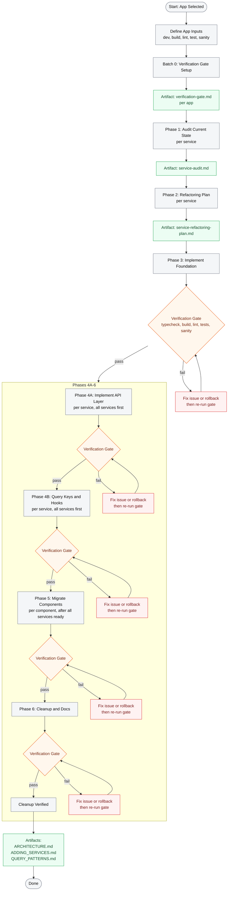

# Service Refactor Lifecycle

Friendly, end-to-end lifecycle for refactoring the service layer per app.

How to read:
- The flow is top-to-bottom.
- The verification gate happens after Phase 3, Phase 4A, Phase 4B, and after all component migrations in Phase 5.
- Phase 4A and 4B repeat per service until all services are implemented.
- Phase 5 starts only after all services are ready.

Phase summary:

| Phase | Goal | Output | Gate |
| --- | --- | --- | --- |
| 0. Verification Gate Setup | Define per-app commands and checks | `verification-gate.md` | No |
| 1. Audit | Inventory services, endpoints, and pain points | `service-audit.md` | No |
| 2. Plan | Define colocated structure and per-service plan | `service-refactoring-plan.md` | No |
| 3. Foundation | Set up API client and TanStack Query | Shared infra in `src/lib` | Yes |
| 4A. API Layer | Build per-service API layer for all services | New service API folders | Yes |
| 4B. Hooks | Build query keys and hooks for all services | New service hooks | Yes |
| 5. Migrate Components | Move components to new hooks after all services exist | Updated components | Yes |
| 6. Cleanup & Docs | Remove old services, document patterns | `ARCHITECTURE.md`, `ADDING_SERVICES.md`, `QUERY_PATTERNS.md` | Yes |

Notes:
- `verification-gate.md` is created in Batch 0 per app at `APP_PATH/docs/refactor/verification-gate.md`.
- Old services stay in place until 100% of components are migrated.
- The gate is mandatory after Phase 3, Phase 4A, Phase 4B, after all component migrations in Phase 5, and Phase 6.
- Repeat the full lifecycle per app in the monorepo.
